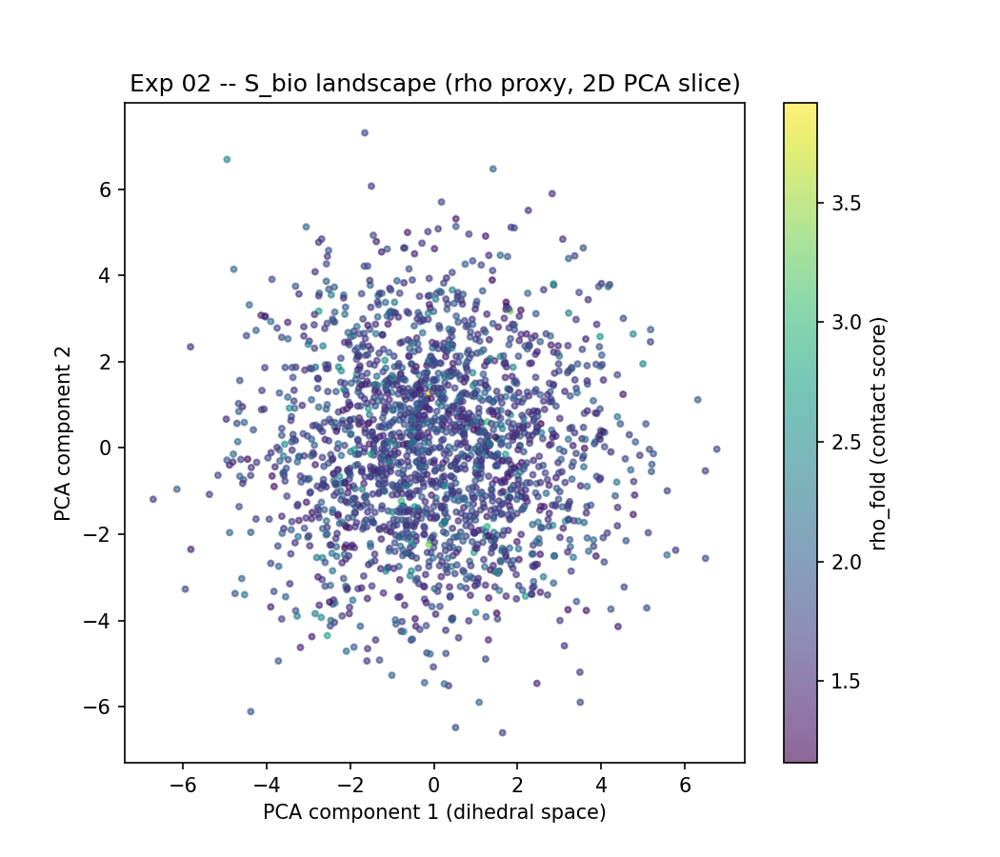

# Experiment 02 -- Levinthal Paradox (The Bio Double-Slit)

**Status:** Ready to run
**Physics analogy:** Double-slit interference

## Objective

Resolve the Levinthal Paradox under UKFT: a 20-residue chain has ~10^26 possible
conformations, yet folds rapidly. UKFT explains this as choice-guided collapse --
the discrete stepper does not search randomly; it follows the least-action
gradient toward the native (high-rho) basin.

## UKFT Prediction

UKFT choice-guided folding converges in O(L^2) steps.
Random walk does not converge in 10x that budget.

## Design

| Condition | Stepper              | n_residues | n_steps |
|-----------|----------------------|-----------|---------|
| A (UKFT)  | step_discrete        | 20        | 500     |
| B (Random)| Random dihedral walk | 20        | 5000    |

Both conditions start from the same random initial configuration.
5 independent trials each.

## Figures

**Fig 1: UKFT vs Random folding trajectories**

*rho_fold vs step for UKFT (least-action, 500 steps) vs random dihedral walk (5000 steps). UKFT converges; random walk does not.*

---

**Fig 2: S_bio action landscape (2D PCA slice of dihedral space)**

*2000 random conformations projected onto first two PCA components, coloured by rho_fold. The high-rho basin (yellow) is the God Attractor target.*

## UKFT Interpretation

The God Attractor V_god ensures a global pull toward the high-rho native basin.
The kinetic term K prevents wild jumps. Together they channel the trajectory as
the double-slit barrier channels the wavefunction into interference fringes:
structure from the geometry of the choice field, not exhaustive search.

The Levinthal Paradox dissolves when you recognize that protein folding is not
a search problem -- it is a collapse problem. The chain does not explore
conformational space; it follows the gradient of S_bio.
