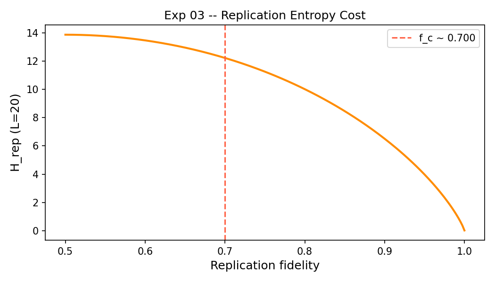

# Experiment 03 -- Error Threshold Sweep

**Status:** Ready to run
**Physics analogy:** Entropic alpha sweep (ukftphys Exp 03)

## Objective

Map the phase boundary between replication survival and error catastrophe as a
function of fidelity. Show that the sharp transition is a fundamental property
of S_bio, not a model artifact.

## UKFT Prediction

Critical fidelity f_c ~ 1 - 1/(L * sigma_selection).
The transition is sharp (first-order-like): rho_final vs fidelity produces a
step function, not a smooth decay.

## Design

Sweep fidelity in [0.70, 0.995] at 22 evenly-spaced values.
Each level: 5 independent populations of 50 agents for 200 steps.
Measure: mean final rho_bio across surviving agents.

## Figures

**Fig 1: Error threshold phase diagram**

*Mean final rho_bio vs replication fidelity across 22 levels x 5 trials x 50 agents. f_c marks the estimated critical fidelity (half-maximum crossing). The transition is sharp.*

---

**Fig 2: Replication entropy H_rep(fidelity, L)**

*H_rep diverges as fidelity -> 0 and reaches zero at perfect fidelity. The intersection with the selection gradient determines f_c.*

## UKFT Interpretation

The phase diagram is the bio analogue of the entropic alpha sweep in ukftphys
Exp 03. Below f_c, the replication entropy H_rep overwhelms the selection
gradient and the population loses all heritable structure.

The sharpness of the transition is a UKFT fingerprint: entropy gaps do not
degrade gracefully -- they collapse. This is the analogue of the quantum
decoherence threshold in the physical UKFT.
