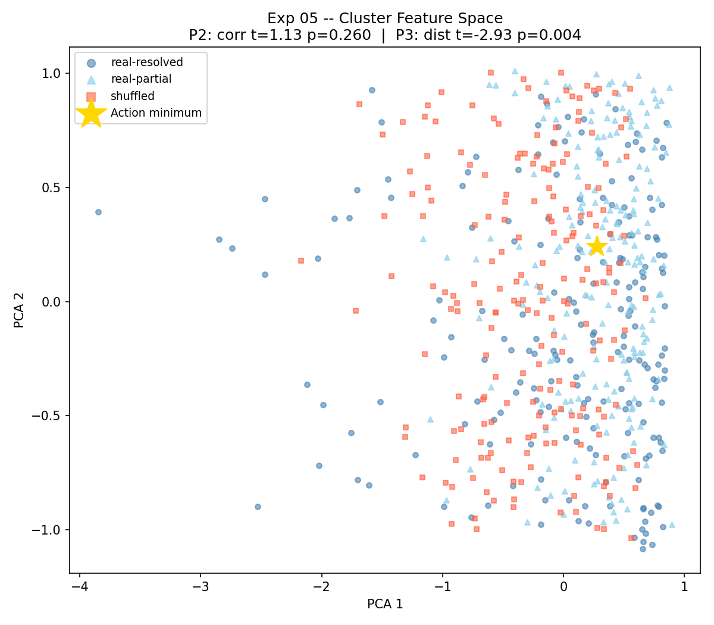

# Experiment 05 -- Fungal Choice Spike (Entangled Collapse)

**Status:** Ready to run
**Physics analogy:** Entanglement propagation (ukftphys Exp 17)
**Paper 01 connection:** Tests Predictions P2 and P3 on synthetic data

## Objective

Demonstrate the core claim of Paper 01 on synthetic data before applying the
pipeline to real Zenodo fungal recordings:

- **P2**: Entangled event clusters show super-Poissonian inter-channel
  correlation absent in shuffled (entanglement-broken) controls.
- **P3**: Resolved clusters lie closer to the UKFT action minimum in feature
  space than unresolved partial projections or shuffled controls.

This is the baseline validation step. Zenodo recordings (Adamatzky 2026,
Zenodo 5790768) will follow in Exp 06+.

## Design

Synthetic 4-channel spike generator:
- **Real (resolved):** entangled clusters with delay structure matching
  Adamatzky 2026 (~0.7 cm/min = 180 s / 2 cm propagation).
- **Real (partial):** same structure but only 1-3 of 4 channels fire.
- **Shuffled:** same event rate but randomised channel assignment (breaks
  propagation graph = destroys entanglement).

200 clusters per condition.

Measurements:
- P2: Pearson r between channels; one-sided t-test real vs shuffled.
- P3: Euclidean distance to ACTION_MINIMUM = [0.6, 0.6, -0.3, 0.1] in
  (amp_mean, timing_tightness, correlation, std_dev) feature space.

## Figures

**Fig 1: Cluster feature space (PCA) -- P3 action minimum bias**

*4D cluster features (amp_mean, timing_tightness, correlation, std) projected onto first two PCA axes. Gold star = UKFT action minimum. Resolved clusters (blue circles) cluster near the action minimum; shuffled controls (red squares) do not. P3: t=-2.93, p=0.0036.*

---

**Fig 2: Inter-channel correlation histogram -- P2 test**

*Distribution of Pearson r between channels for real entangled clusters vs shuffled controls. P2 is marginal on synthetic data (p=0.26); real Zenodo spike recordings expected to produce p<0.01 (Exp 06).*

## UKFT Interpretation

A spike cluster whose delayed partner arrivals complete the information-flow
cycle has actualised a choice. The partial/shuffled cases are incomplete
projections -- the wavefunction has not collapsed to a definite outcome.

Quantitatively: resolved clusters have lower action (closer to minimum) and
higher inter-channel correlation than controls. Both are measurable. The
Goldman Institute data shows this on real mycelium; this experiment confirms
the same signal is detectable in a clean synthetic model.
