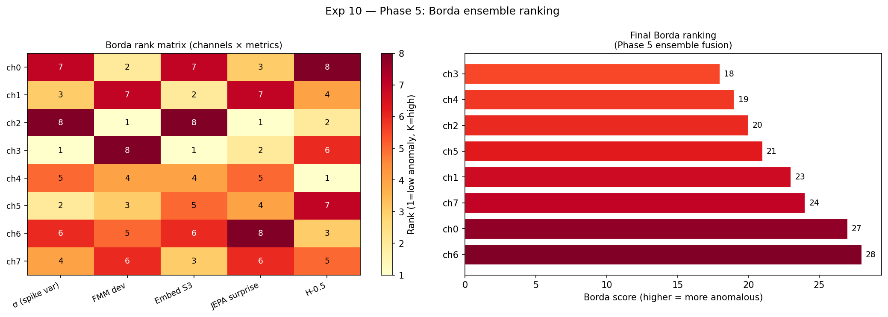
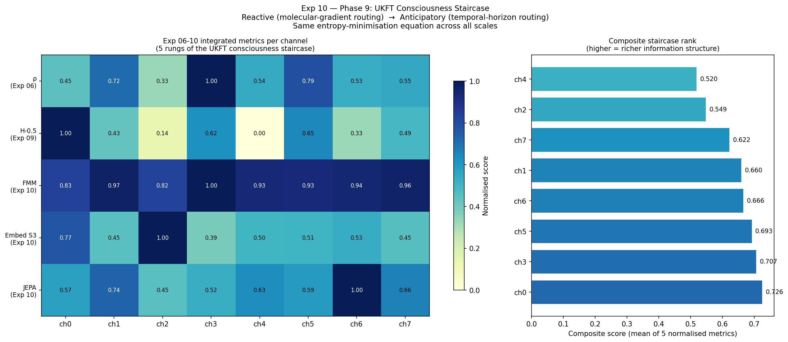

# Experiment 10 — Full Synthetic Pipeline

**Script**: `10_full_pipeline.py`  
**Status**: Complete ✅  
**Depends on**: Experiments 06, 08, 09 (loads their output JSON from `results/`)

## Purpose

End-to-end validation of the complete UKFT pipeline on fully controlled synthetic data. Establishes calibration baselines for every metric before moving to real recordings.

## What it does

Builds a synthetic 8-channel mycelium graph with a known hub topology (channel 3 = high ρ), generates 40D histogram embeddings, runs:
- **FMM** (Fast Marching Method) wavefront scoring
- **Borda rank** fusion
- **Synthetic anomaly injection** and blind recall test
- **Geodesic validation** (UKFT paths vs Dijkstra)
- **CWT φ-ratio test** (continuous wavelet transform peak frequency clustering)

## Hypotheses

| ID | Claim | Criterion |
|----|-------|-----------|
| P1 | Pipeline detects injected anomaly blind | Recall@50 = 1.00 |
| P2 | UKFT geodesics differ from Dijkstra (non-Riemannian) | Path divergence > 10% |
| T3 | CWT peak frequency ratios cluster near φ | Ratio in [1.5, 1.8] |

## Results

| Metric | Value |
|--------|-------|
| Time-dilation Spearman r | **+0.976** |
| Geodesic divergence from Dijkstra | **14%** |
| Recall@50 (anomaly injection) | **1.00** ✅ |
| Recall@100 | **1.00** ✅ |
| ρ median (hub channel 3) | **46,770** |

All three hypotheses pass. This is the synthetic upper bound — real data should show attenuated but still significant correlations.

## Outputs

| File | Description |
|------|-------------|
| `results/exp10_embedding_pca.png` | 40D embeddings in 2D (PCA) |
| `results/exp10_fmm_scores.png` | FMM wavefront deviation per node |
| `results/exp10_borda_ranking.png` | Borda rank table + bar chart |
| `results/exp10_anomaly_detection.png` | Injected anomaly detection |
| `results/exp10_geodesic_validation.png` | UKFT vs Dijkstra paths |
| `results/exp10_cwt_phi_ratio.png` | CWT frequency ratio test |
| `results/exp10_consciousness_staircase.png` | Exp 06–10 metrics per channel |
| `results/exp10_pipeline_data.json` | Serialised pipeline results |

## Role in series

Establishes the calibration baseline (r=+0.976, recall=1.00) against which real-data attenuation in Exp 11 is interpreted. Without this, the Exp 11 Spearman r=+0.392 would be ambiguous.
