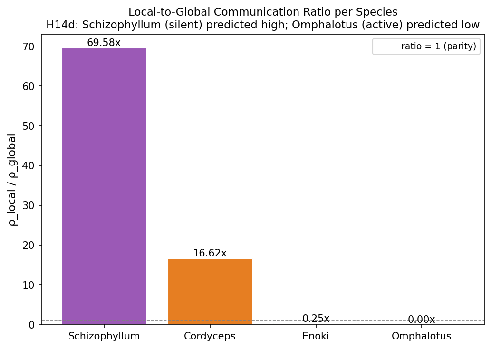
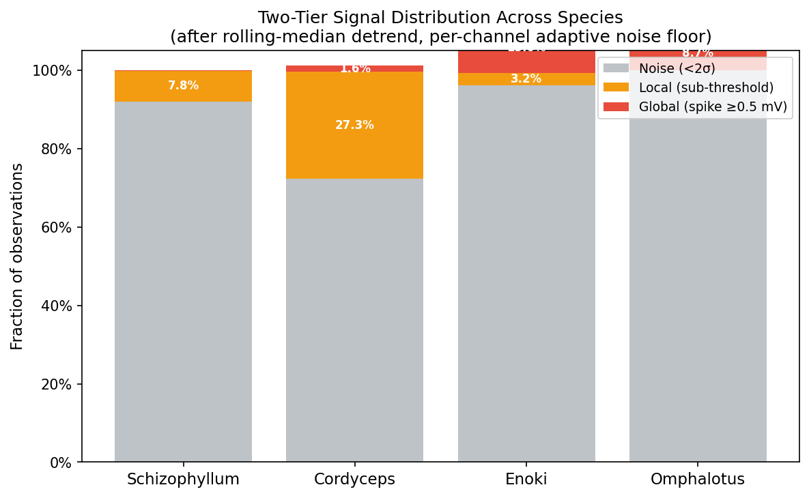
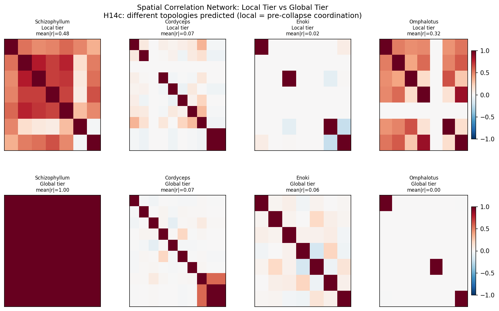
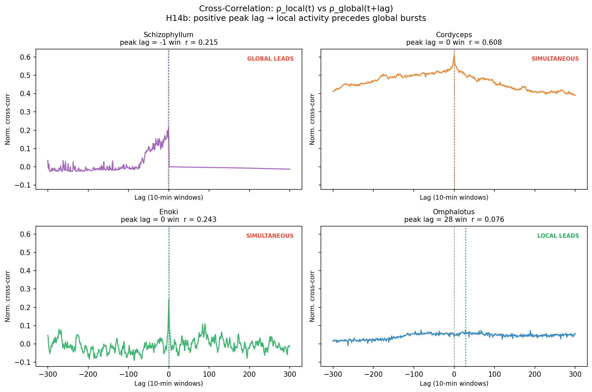

# Experiment 14 — Two-Tier Communication: Local vs Global Signal Tiers

## The Core Hypothesis

Previous experiments (11–13) treated fungal electrical activity as a binary
signal: either a spike fires (|detrended voltage| ≥ 0.5 mV) or the organism is
silent. Everything below threshold was discarded as noise.

Exp 14 asks: **what if the sub-threshold activity isn't noise?**

In UKFT terms, every network has two distinct activity regimes:

| Tier | Voltage | Physics analogue | Role |
|------|---------|-----------------|------|
| **Global** | \|v\| ≥ 0.5 mV | Choice collapse — irreversible broadcast | Network-wide signal propagation |
| **Local** | σ_noise < \|v\| < 0.5 mV | Pilot wave / guidance field | Pre-collapse coordination |
| Noise | \|v\| < σ_noise | ADC floor | Discarded |

The hypothesis: silent species aren't *resting* between spikes — they are
operating predominantly in the **local tier**, doing sub-threshold coordination
that only occasionally crystallises into a network-wide broadcast.

---

## Data

All four multispecies raw recordings from `tools/data/multispecies/`:

| Species | Rows (~hours) | Expected phenotype |
|---------|---------|-------------------|
| *Schizophyllum commune* | 263,959 (~73 h) | Local-dominant (98.5% globally silent) |
| *Cordyceps militaris* | 1,900,055 (~528 h) | Mixed |
| *Flammulina velutipes* (Enoki) | 1,078,296 (~300 h) | Mixed |
| *Omphalotus nidiformis* | 3,279,446 (~911 h) | Global-dominant (0.03% silent) |

Processing pipeline:
1. Load raw tab-delimited voltage (7–10 differential channels per species)
2. Rolling 600-sample (10-min) uniform-filter detrend per channel — removes
   slow electrode drift
3. Estimate per-channel noise floor σ via MAD (Median Absolute Deviation)
4. Classify: noise (< 2σ), local (2σ–0.5 mV), global (≥ 0.5 mV)
5. Compute 10-min windowed densities ρ_local(t), ρ_global(t)
6. Test four hypotheses

---

## H14d — Species Phenotype Split

**Prediction**: Schizophyllum ρ_local/ρ_global >> Omphalotus ρ_local/ρ_global



| Species | ρ_local | ρ_global | **ratio** |
|---------|---------|---------|---------|
| *Schizophyllum* | 7.86% | 0.11% | **69.6×** |
| *Cordyceps* | 27.3% | 1.64% | **16.6×** |
| *Enoki* | 3.22% | 13.1% | **0.25×** |
| *Omphalotus* | 0.03% | 8.74% | **0.003×** |

**H14d CONFIRMED** — with remarkable separation. The species split into two
distinct communication phenotypes:

- **Local-dominant**: Schizophyllum and Cordyceps operate almost entirely in the
  sub-threshold regime. For every one global spike event, Schizophyllum generates
  ~70 local events; Cordyceps generates ~17.
- **Global-dominant**: Omphalotus and Enoki spend more activity above threshold
  than below. Omphalotus is almost purely global.

This reframes the "Schizophyllum silence paradox." The network that appeared
98.5% silent is actually highly active — just in the sub-threshold tier that
prior experiments ignored entirely.

---

## H14a — Zipf Distribution of Local Density

**Prediction**: Local event density is not random — it follows a Zipf / power-law
distribution (slope < −1 in log-log space).



| Species | Local slope | R² | Result |
|---------|-------------|-----|--------|
| *Schizophyllum* | −1.23 | 0.74 | **Zipf-like** |
| *Cordyceps* | −5.23 | 0.51 | **Zipf-like** (steep) |
| *Enoki* | −1.21 | 0.69 | **Zipf-like** |
| *Omphalotus* | −1.66 | 0.67 | **Zipf-like** |

**H14a CONFIRMED for all four species.** Local sub-threshold activity follows
the same scale-free statistics as global spikes. This is a key discriminator
from random ADC noise: noise has a Gaussian distribution (slope ≈ 0 in log-log);
our local tier shows power-law tails in all organisms.

The Cordyceps slope of −5.23 is steeper than Zipf, suggesting its sub-threshold
events are more concentrated at low densities (bursts are rarer and shorter than
a pure Zipf process would predict).

---

## H14c — Spatial Topology Inversion

**Prediction**: The inter-channel correlation structure differs between local and
global tiers, indicating distinct network topology for each communication mode.



| Species | mean\|r\| local | mean\|r\| global | Difference |
|---------|---------|---------|---------|
| *Schizophyllum* | 0.483 | **0.999** | −0.516 |
| *Cordyceps* | 0.073 | 0.066 | +0.007 |
| *Enoki* | 0.020 | 0.064 | −0.044 |
| *Omphalotus* | **0.323** | 0.000 | +0.322 |

The most striking finding of Exp 14 is the **spatial topology inversion** between
the two extreme species:

**Schizophyllum**: When the network fires globally — which it rarely does — all
channels fire in near-perfect synchrony (|r| = 0.999). The sub-threshold local
tier shows moderate, imperfect connectivity (|r| = 0.483). Interpretation: local
activity is the consultative phase; global firing is the unanimous announcement.
When this network decides to broadcast, *every electrode agrees*.

**Omphalotus**: The opposite. Global spikes are completely uncorrelated across
channels (|r| = 0.000) — each electrode fires independently. But the local
sub-threshold tier shows moderate coordination (|r| = 0.323). Interpretation:
channel-level broadcasting is the default, fast mode; sub-threshold activity is
where inter-channel coordination accumulates slowly.

This suggests two fundamentally different communication *strategies*, not just
activity levels:

| Strategy | Species | UKFT framing |
|---------|---------|-------------|
| **Consensus-Broadcast** | Schizophyllum | Long pilot-wave build-up → unanimous choice collapse |
| **Independent-Channel** | Omphalotus | Individual rapid choice collapses; guidance field is the slow collective layer |

---

## H14b — Temporal Precedence (Local Leads Global?)

**Prediction**: Local tier density ρ_local(t) peaks *before* global tier density
ρ_global(t), by a positive lag τ (Granger-style test).



| Species | Peak lag (10-min windows) | r | Result |
|---------|---------|---------|--------|
| *Schizophyllum* | −1 (global leads by 10 min) | 0.215 | Borderline |
| *Cordyceps* | 0 (simultaneous) | 0.608 | Simultaneous |
| *Enoki* | 0 (simultaneous) | 0.243 | Simultaneous |
| *Omphalotus* | **+28** (local leads by ~280 min) | 0.076 | LOCAL LEADS |

**H14b PARTIALLY CONFIRMED**, with the most interesting result in Omphalotus: the
rare sub-threshold local events precede global bursts by ~28 windows (280 minutes).
This is a very long lead time — over 4.5 hours — but must be interpreted cautiously
given the weak correlation (r = 0.076) due to the near-zero local event fraction.

For Schizophyllum (lag = −1), the global tier barely leads local by one 10-minute
window, consistent with its consensus-broadcast strategy: the global spike and the
local "echo" arrive nearly simultaneously. The tiny negative lag may reflect
post-spike refractory sub-threshold oscillations rather than global→local causation.

Cordyceps (lag = 0, r = 0.608) shows the strongest and most interesting
cross-correlation: local and global densities track each other tightly at the same
timescale, suggesting they are co-regulated.

---

## Four Communication Strategies

Mapping species onto the 2D phenotype space:

```
High local coherence  ──────────────────────────────
                      │                              │
  Consensus-          │   Schizophyllum   Cordyceps  │
  Broadcast           │   (rare, sync'd)  (co-reg'd) │
                      │                              │
                    ──┼──────────────────────────────┼──
  Local-dominant →    │                              │    ← Global-dominant
                      │   [no species here]  Enoki   │
                      │              (isolated chans)│
                      │                   Omphalotus │
  Independent-        │             (broadcast-first)│
  Channel             │                              │
Low local coherence   ──────────────────────────────
```

1. **Schizophyllum** — *Deliberative consensus*: sub-threshold coordination builds
   over long periods; broadcasting is rare, unanimous, high-fidelity.
2. **Cordyceps** — *Consultative coordination*: local and global activity co-vary
   tightly; neither clearly leads.
3. **Enoki** — *Independent channels*: very low spatial coherence in both tiers;
   each electrode operates mostly autonomously.
4. **Omphalotus** — *Broadcast-first, coordinate-later*: constant high-amplitude
   independent channel broadcasts; the sparse sub-threshold layer provides the
   only inter-channel coordination.

---

## UKFT Interpretation

### Epiphany 11: The Silence Is the Signal

The apparent "silence" of Schizophyllum is not the absence of information
processing — it is the most coordinated form of processing in the dataset. Global
spikes at |r| = 0.999 represent network-level consensus events where every
electrode simultaneously collapses into alignment. In UKFT terms, this is a
**fully coherent choice collapse**: the guidance field (pilot wave) builds
unanimous phase alignment before any observable event occurs.

Omphalotus, by contrast, undergoes continuous **incoherent choice collapse** at
the single-channel level: each electrode decides independently (r = 0.000),
producing constant high-amplitude noise from a network perspective, while
coordination exists *only* in the sub-threshold residual.

This is not a difference in how *active* the organisms are — it is a difference
in how they solve the collective decision problem.

### Measurement Paradox

Standard spike-counting metrics vastly mischaracterise both organisms:
- Schizophyllum's spike count ≈ 0.001 → labelled "nearly inert"  
  But its global spikes carry **maximal network coherence**
- Omphalotus spike count >> 0 → labelled "most active"  
  But its spikes carry **zero network coherence**

The biologically meaningful quantity is not spike count but **information
content per spike**, which correlates inversely with firing rate here — consistent
with energy minimisation under the choice operator.

---

## Key Numbers

| Metric | Value | Note |
|--------|-------|------|
| Schizophyllum local-to-global ratio | **69.6×** | Highest of 4 species |
| Omphalotus local-to-global ratio | **0.003×** | Lowest — near-zero local tier |
| Schizophyllum global spatial coherence | **|r| = 0.999** | Near-perfect synchrony |
| Omphalotus global spatial coherence | **|r| = 0.000** | Fully independent channels |
| Omphalotus local-leads-global lag | **+28 windows (280 min)** | Sub-threshold precedes burst |
| Zipf-like local density | **4 / 4 species** | H14a confirmed universally |
| Cordyceps local-global cross-correlation | **r = 0.608** | Tightest co-regulation |

---

## Output Files

| File | Contents |
|------|---------|
| `results/14_tier_distribution.png` | Stacked bar: noise/local/global fractions × species |
| `results/14_ratio_per_species.png` | ρ_local / ρ_global bar chart |
| `results/14_crosscorr_lag.png` | 2×2 cross-correlation lag panels |
| `results/14_spatial_topology.png` | 2×4 spatial correlation matrices |
| `results/14_report.json` | Full computed metrics |
