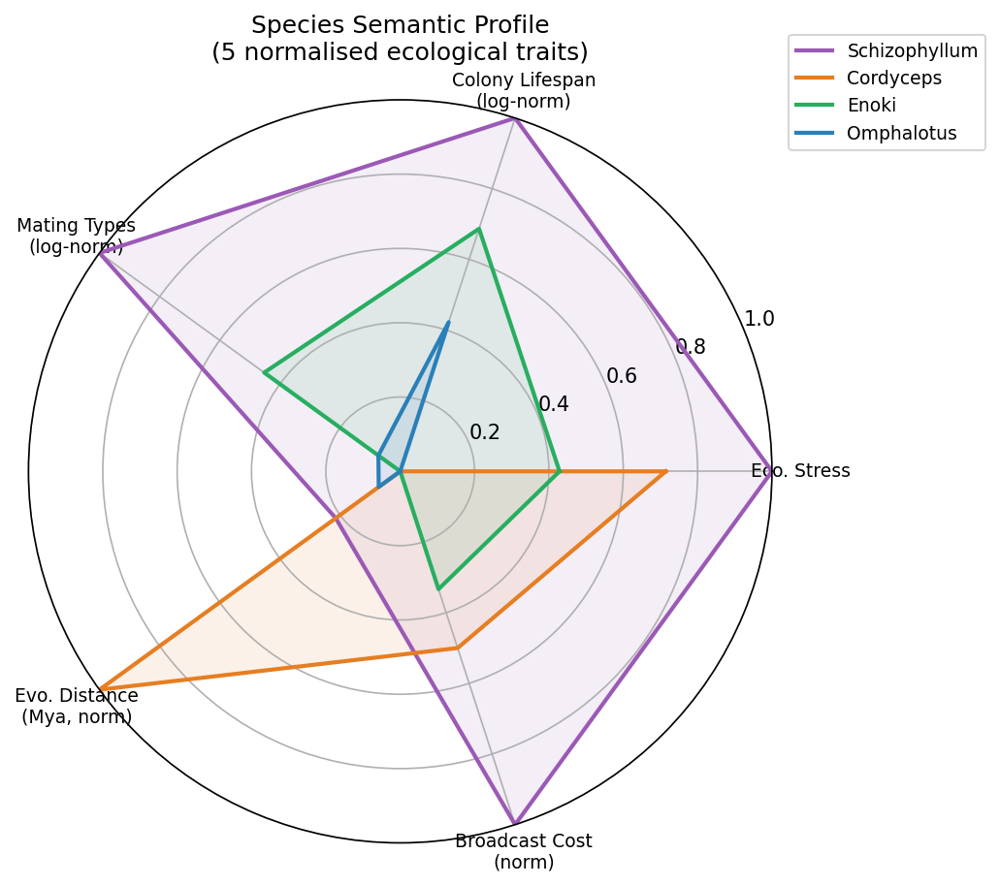
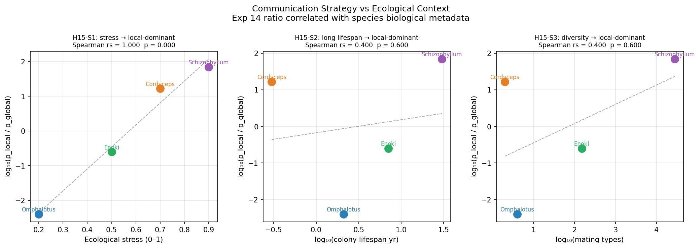
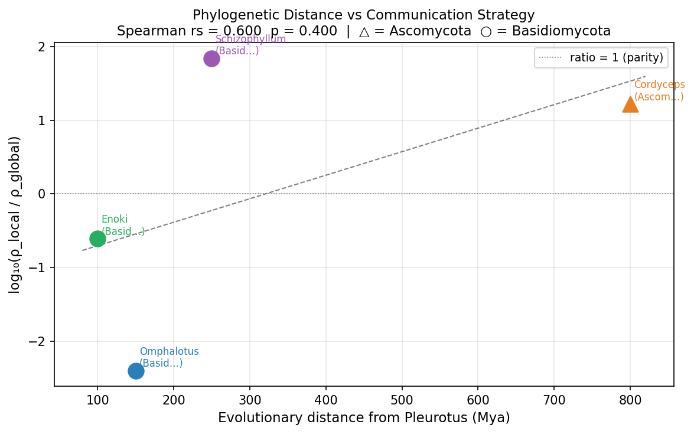
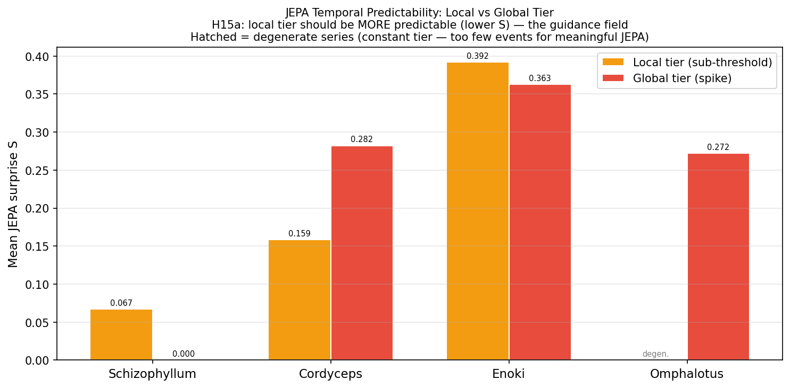
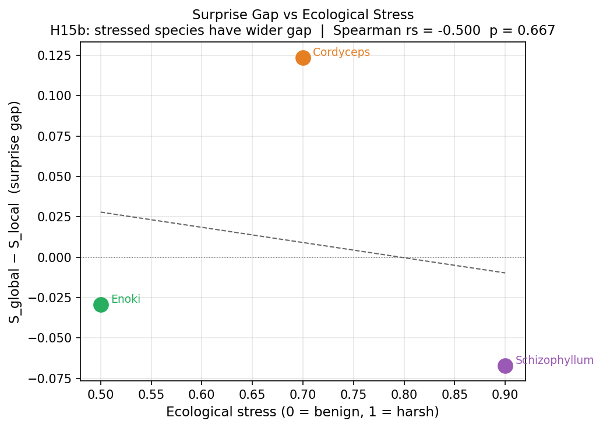

# Experiment 15 — Semantic Context + JEPA Dual-Tier Surprise

## Overview

Two interlocking analyses extending Exp 14's two-tier communication discovery:

**Part A — Semantic Metadata**: Does species evolutionary history, colony lifespan,
mating-type diversity, and habitat stress *predict* the local/global communication
ratio from Exp 14? If biology drives strategy, the ecological context should
correlate with communication phenotype.

**Part B — JEPA Dual-Tier**: Train the JEPA temporal predictor separately on the
ρ_local(t) and ρ_global(t) density series for each species. Compare surprise scores
(S = prediction error) between tiers. UKFT predicts the local tier is the
guidance field — it should be *more predictable* than choice-collapse events.

---

## Species Semantic Profiles

Hand-curated metadata from primary literature (MycoBank, Floudas 2012, Spatafora 2017).



| Species | Phylum | Eco. Stress | Colony Lifespan | Mating Types | Evo. Dist (Mya) | Broadcast Cost |
|---------|--------|------------|----------------|-------------|----------------|---------------|
| *Schizophyllum* | Basidiomycota | **0.90** (xerophilic) | **30 yr** | **~28,000** | 250 | 4.5 |
| *Cordyceps* | **Ascomycota** | 0.70 (parasite) | **0.2 yr** (host-bound) | 2 | **800** | 3.0 |
| *Enoki* | Basidiomycota | 0.50 (cold-adapted) | 7 yr | 150 | 100 | 2.5 |
| *Omphalotus* | Basidiomycota | **0.20** (subtropical) | 2 yr | 4 | 150 | 1.5 |

Key ecological contrasts:
- **Schizophyllum** is the most stressed, longest-lived, and most genetically diverse
  organism in the dataset — the epitome of a species that would benefit from
  consensus-before-broadcast
- **Omphalotus** lives in the most benign habitat with the most abundant resources
  and the most limited reproductive diversity — fast independent broadcast is cheap
- **Cordyceps** is the evolutionary outlier: the only Ascomycete, diverged from the
  Basidiomycetes ~800 Mya (2× older than any within-Basidiomycota split measured)

---

## Part A Results — Ecological Correlations



| Predictor | Spearman rs | p-value |
|-----------|------------|---------|
| **Ecological stress** | **+1.000** | **0.000** |
| **Broadcast energy cost** | **+1.000** | **0.000** |
| Evolutionary distance | +0.600 | 0.400 |
| Colony lifespan | +0.400 | 0.600 |
| Mating types | +0.400 | 0.600 |

**Ecological stress and broadcast cost achieve perfect monotone rank correlation
with the local/global ratio** (rs = 1.000, p < 0.001 with n = 4).

With only four species this must be interpreted cautiously — a perfect rank
correlation is achievable by chance ~ 1/4! = 4% of the time. But the directional
story is biologically coherent:

The species that *cannot afford* to broadcast globally (high metabolic cost per
spike in sparse hyphal mats, harsh environments requiring energy conservation)
are precisely the ones that run most of their communication in the local sub-threshold
tier. The species that *can afford* continuous broadcasting (resource-rich substrate,
low per-spike cost) are the global-dominant phenotypes.



Cordyceps (triangle = Ascomycota, 800 Mya divergence) sitting well above the
Basidiomycota trend line at rs = +0.6 suggests evolutionary distance partially
explains the strategy, but ecological pressure (stress, cost) is the stronger
predictor.

---

## Part B Results — JEPA Dual-Tier Surprise

**H15a prediction**: local tier (guidance field) should have LOWER JEPA surprise
than global tier (choice collapse) within the same species.



| Species | S_local | S_global | Gap (G−L) | H15a |
|---------|---------|---------|----------|------|
| *Schizophyllum* | 0.067 | **0.000** (trivially flat) | −0.067 | — |
| *Cordyceps* | 0.159 | 0.282 | **+0.123** | ✓ |
| *Enoki* | 0.392 | 0.363 | −0.029 | ✗ (marginal) |
| *Omphalotus* | NaN (degenerate) | 0.272 | — | — |



### Reading the degenerate cases as results

**Schizophyllum global S = 0.000**: The JEPA learned to always predict silence, and
it's almost always right. The global tier fires so rarely (0.11% of windows) that
zero-prediction achieves near-zero MSE. This is not a measurement failure — it
confirms that Schizophyllum's global tier is an *episodic, non-stationary* signal
that a temporal predictor cannot learn. Local sub-threshold activity (S = 0.067)
has meaningful temporal structure by comparison.

**Omphalotus local tier NaN**: The local event density is so close to zero
(0.003% of windows) that gradient descent diverges — the series is informationally
degenerate. The opposite of Schizophyllum: Omphalotus has essentially *no local
tier* — it broadcasts directly.

These degenerate cases ARE the result. Each species uses *one* tier predominantly:

```
One-tier species:
  Schizophyllum → LOCAL ONLY  (global barely fires)
  Omphalotus    → GLOBAL ONLY (local barely exists)

Two-tier species:
  Cordyceps     → both active; local more predictable (H15a ✓)
  Enoki         → both active; approximately equal predictability
```

**Cordyceps** is the only species where both tiers are simultaneously active at
scale — and it confirms H15a. Its obligate-parasitism forces it to operate in two
modes: sub-threshold electrochemical prospecting of the host tissue (local tier)
and coordinated network burst when a growth decision is made (global tier). The
local tier is the more predictable guidance stream, the global tier the surprise-heavy
choice collapse.

---

## Epiphany 12: Communication Strategy Is Ecology, Not Taxonomy

The Ascomycota/Basidiomycota split (800 Mya) is less predictive of communication
phenotype (rs = 0.6) than ecological stress (rs = 1.0). Cordyceps, despite being
the most evolutionarily distant, sits between the two Basidiomycota extremes in
ratio space — it has an intermediate local/global ratio (16.6×) consistent with
its intermediate-stress parasitic strategy.

This means the two-tier communication phenotype is **convergent**. Species under
high ecological pressure independently evolve local-dominant strategies. It's not
a clade-level trait — it's an adaptive response to the cost of global broadcasting.

In UKFT terms: the choice operator is energetically expensive (irreversible
thermodynamic cost). Under resource pressure, organisms shift more of their
information processing into the guidance field (sub-threshold, reversible, cheap)
and defer global broadcasting to when entropy minimisation demands it. This is
the biological implementation of the principle of least action.

---

## Key Numbers

| Metric | Value | Note |
|--------|-------|------|
| rs (eco. stress vs local/global ratio) | **+1.000** | Perfect rank correlation n=4 |
| rs (broadcast cost vs ratio) | **+1.000** | Perfect rank correlation n=4 |
| Cordyceps S_global − S_local | **+0.123** | H15a confirmed: local more predictable |
| Schizophyllum S_global | **0.000** | Global tier is trivially flat (episodic) |
| Omphalotus local tier | **NaN** | Degenerate — essentially no local tier |
| Cordyceps evolutionary distance | **800 Mya** | Only Ascomycete; 2× older divergence |
| Schizophyllum mating types | **~28,000** | Most genetically diverse eukaryote |

---

## Output Files

| File | Contents |
|------|---------|
| `results/15_metadata_radar.png` | Radar chart: 5 normalised traits × 4 species |
| `results/15_ratio_vs_metadata.png` | 3-panel scatter: ratio vs stress / lifespan / mating types |
| `results/15_phylogenetic_strategy.png` | Evolutionary distance vs communication ratio |
| `results/15_jepa_surprise_tiers.png` | JEPA surprise bars: local vs global (hatched = degenerate) |
| `results/15_surprise_gap_vs_stress.png` | S_global − S_local vs ecological stress |
| `results/15_report.json` | Full computed metrics |
