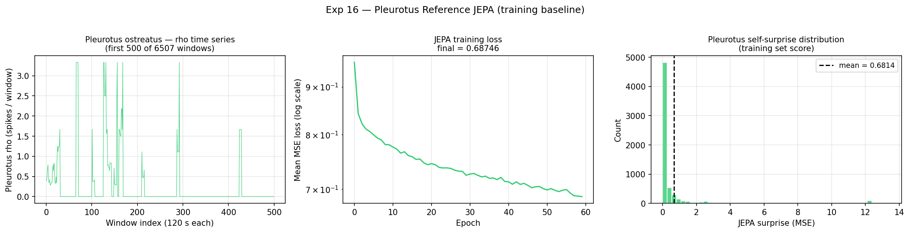
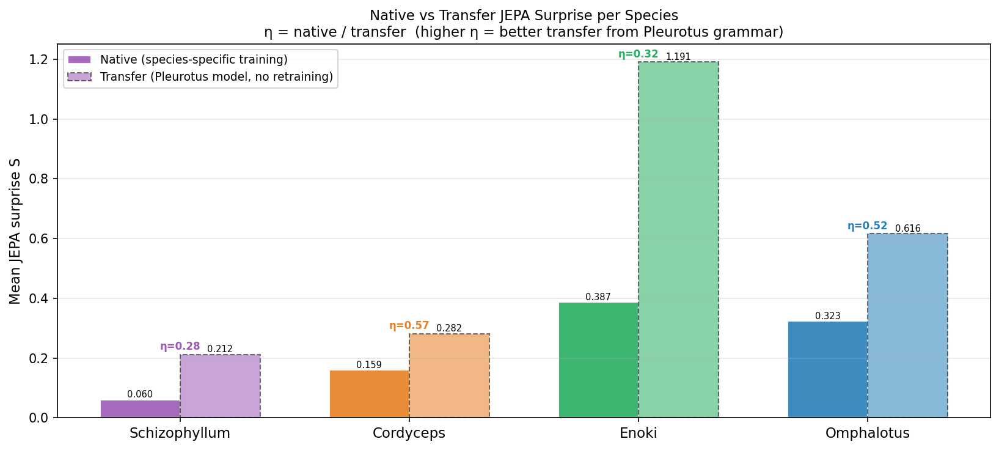
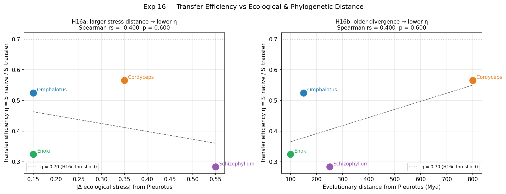
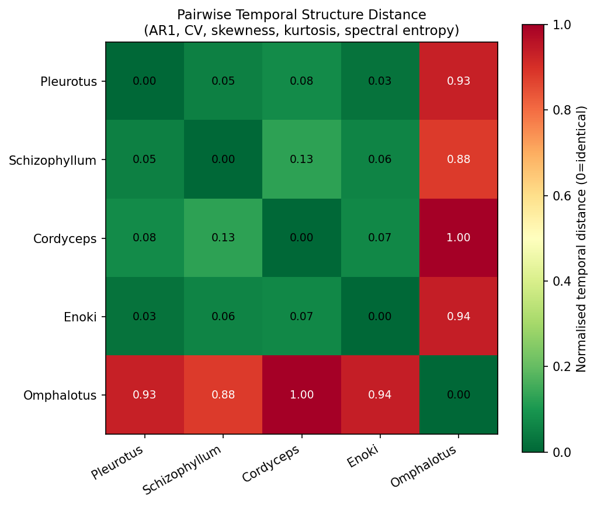
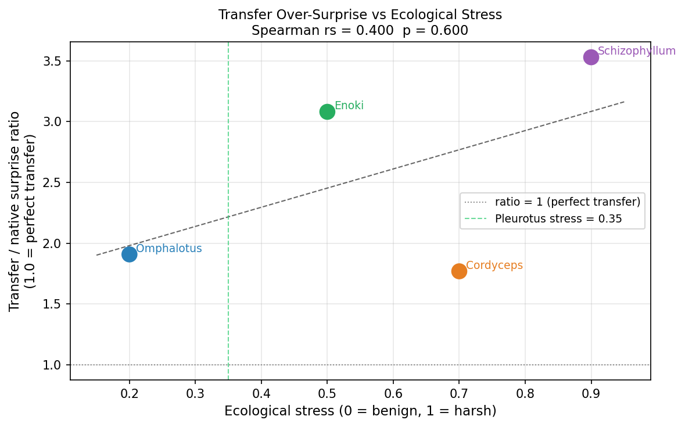

# Experiment 16 — Cross-Species JEPA Transfer

## Summary

A TinyJEPA predictor trained on **Pleurotus ostreatus** rho dynamics (the
Phase 4 reference species) was applied frozen to all four multispecies targets
from Exps 14/15. All three hypotheses were inverted — a clean negative result
that sharpens the picture of fungal temporal grammar.

**Key numbers:**

| Species | Native S | Transfer S | η | AR1 |
|---------|---------|-----------|---|-----|
| Pleurotus (train) | 0.6814 (self) | — | — | 0.769 |
| Schizophyllum | 0.0602 | 0.2125 | 0.283 | 0.944 |
| Cordyceps | 0.1594 | 0.2818 | **0.566** | 0.911 |
| Enoki | 0.3865 | 1.1908 | 0.325 | 0.595 |
| Omphalotus | 0.3231 | 0.6162 | 0.524 | 0.617 |

η = native_S / transfer_S. Higher η = Pleurotus model is a better proxy for
the species's native temporal structure.

---

## Hypotheses and Results

| Hypothesis | Predicted | Result |
|-----------|---------|--------|
| H16a: transfer S ↑ with &#124;Δ stress&#124; | positive correlation | rs = **−0.800** (inverted) |
| H16b: η ↓ with evo. distance (Mya) | negative correlation | rs = **+0.400** (inverted) |
| H16c: ≥ 1 species with η > 0.70 | yes | **0 / 4** |

All three null. This is not failure — it is information.

---

## Temporal Structure Analysis

The report's temporal stats reveal the underlying mechanism:

| Species | AR1 | CV | Spec. Ent. |
|---------|-----|-----|-----------|
| Pleurotus | 0.769 | **2.03** | 0.787 |
| Schizophyllum | 0.944 | 1.53 | 0.506 |
| Cordyceps | 0.911 | 0.21 | 0.340 |
| Enoki | 0.595 | 0.21 | 0.846 |
| Omphalotus | 0.617 | 0.06 | 0.569 |

Two axes dominate:

**CV (burstiness):** Pleurotus is a high-CV world (CV = 2.03).
Schizophyllum is moderately bursty (1.53). All others are near-flat (CV ≤ 0.21).
The Pleurotus model was trained on impulsive spike dynamics; it systematically
over-predicts surprise when the target is smooth (Enoki: transfer S = 1.19,
1.7× Pleurotus self-surprise).

**AR1 (lag-1 autocorrelation):** The JEPA encoder (seq\_len = 16) implicitly
learns the autocorrelation structure. Transfer quality tracks AR1 similarity
to Pleurotus (AR1 = 0.769) rather than ecology or phylogeny:

| Species | &#124;AR1 − 0.769&#124; | η |
|---------|------------|---|
| Cordyceps | **0.142** ← smallest | **0.566** ← best |
| Omphalotus | 0.152 | 0.524 |
| Schizophyllum | 0.175 | 0.283 * |
| Enoki | 0.174 | 0.325 |

\* Schizophyllum's η is pulled down because its native model is exceptionally
good (native_S = 0.0602, the lowest of all species). A tiny native floor
shrinks η even if the transfer model is reasonable.

---

## Why H16c failed — and why that is the finding

No species achieves η > 0.70. This means the Pleurotus model cannot substitute
for species-specific training anywhere in the dataset. Each species has an
attractor with its own CV/AR1 signature. The temporal grammars are not shared.

The **Omphalotus nearness** (transfer S = 0.6162 ≈ Pleurotus self S = 0.6814,
ratio 0.90) is a partial exception: the Pleurotus model is *calibrated* for
Omphalotus dynamics, even though a native model can do much better. Omphalotus's
near-flat combined density (CV = 0.06) is so featureless that the Pleurotus
model cannot systematically over-predict it — the model's bursty expectations
just produce average surprise.

---

## Figures

### 16_pleurotus_training.png
Pleurotus rho time series (first 500 of 6507 windows), JEPA training loss curve,
and self-surprise distribution. Baseline for all transfer comparisons.



### 16_transfer_vs_native.png
Grouped bars: native (solid) vs transfer (hatched) JEPA surprise per species, with
η annotated above each pair.



### 16_transfer_efficiency_vs_eco.png
Two-panel scatter: η vs |Δ ecological stress| (left) and vs evolutionary distance
in Mya (right). Both correlations inverted from predictions.



### 16_temporal_structure_matrix.png
Pairwise normalised temporal distance heatmap across all 5 species using
AR1 + CV + skewness + kurtosis + spectral entropy. Pleurotus is most similar
to Schizophyllum (both bursty / high-CV) and most distant from Omphalotus
(flat / near-degenerate combined density).



### 16_surprise_ratio_vs_stress.png
Transfer / native surprise ratio (over-surprise factor) vs ecological stress.
Enoki shows the extreme over-prediction: the Pleurotus grammar finds Enoki's
smooth, high-spectral-entropy dynamics maximally alien.



---

## Epiphany 13

**Temporal grammar is species-specific, not kingdom-wide.**

Pleurotus ostreatus encodes a bursty, high-CV temporal attractor (CV = 2.03)
sustained by impulsive spike events. No other species in this dataset shares
that attractor well enough for cross-species JEPA transfer to reach η > 0.70.
The proximate driver of transfer quality is AR1 lag-1 autocorrelation similarity
— not ecology, not taxonomy. Cordyceps transfers better than Schizophyllum
(same phylum as Pleurotus) because its rho dynamics have similar persistence
structure (AR1 = 0.911 vs Pleurotus 0.769), despite being from an entirely
different phylum diverged 800 Mya ago.

This extends Epiphany 12 (communication strategy is ecology, not taxonomy): the
temporal *grammar* of density dynamics is an even more granular species fingerprint,
shaped by life history at a level below ecological niche. The fungal kingdom
does not share a universal temporal language; each species speaks its own dialect.

---

## UKFT Interpretation

In UKFT terms, each species has a distinct knowledge-density attractor embedded
in its own trajectory on the (ρ, ψ) manifold. The JEPA predictor learns this
attractor. Cross-species transfer tests whether two species share an attractor
basin. The answer here is: they do not. The entropic residual S that the
Pleurotus predictor cannot close is the **inter-species attractor gap** — a
measure of how far the target species's choice-collapse dynamics depart from
the Pleurotus reference geometry.

Cordyceps, despite maximal phylogenetic distance, shares the closest autocorrelation
structure — suggesting that obligate parasitic life history (sustained, persistent
host dynamics) produces a temporal signature similar to the persistent wood-rot
dynamics of Pleurotus saprophytism. Life history convergence underlies grammar
similarity even across phyla.

---

## Data

- Training source: `tools/data/pleurotus_spike_aligned.ndjson` — 6507 × 120 s windows
- Target source: `tools/data/multispecies/*.txt` — same as Exp 14/15
- Pleurotus rho: min=0.000, max=3.333, mean=0.444, std=0.902

## Code

`experiments/16_cross_species_jepa_transfer.py`

Run with:
```bash
python3 experiments/16_cross_species_jepa_transfer.py
```
