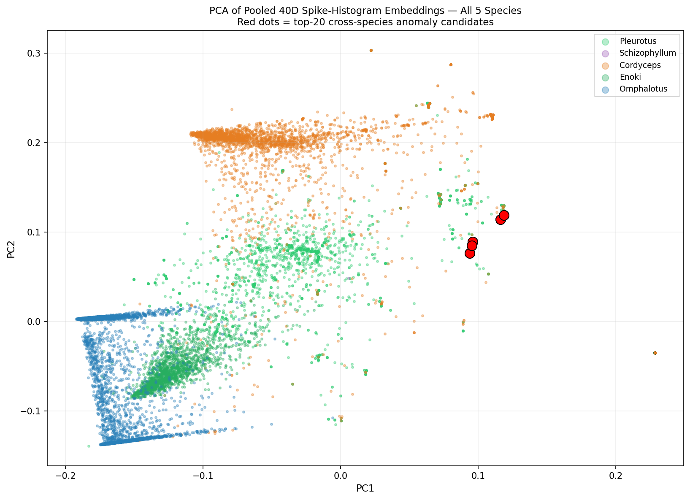
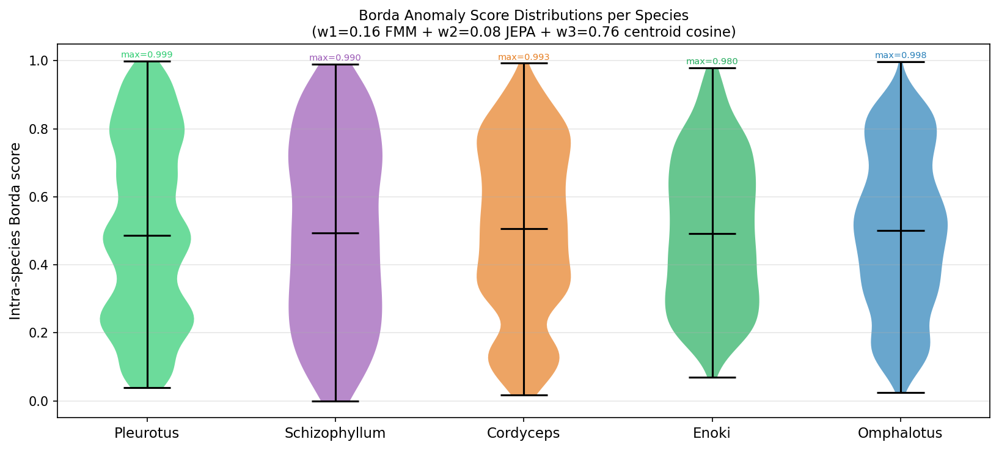
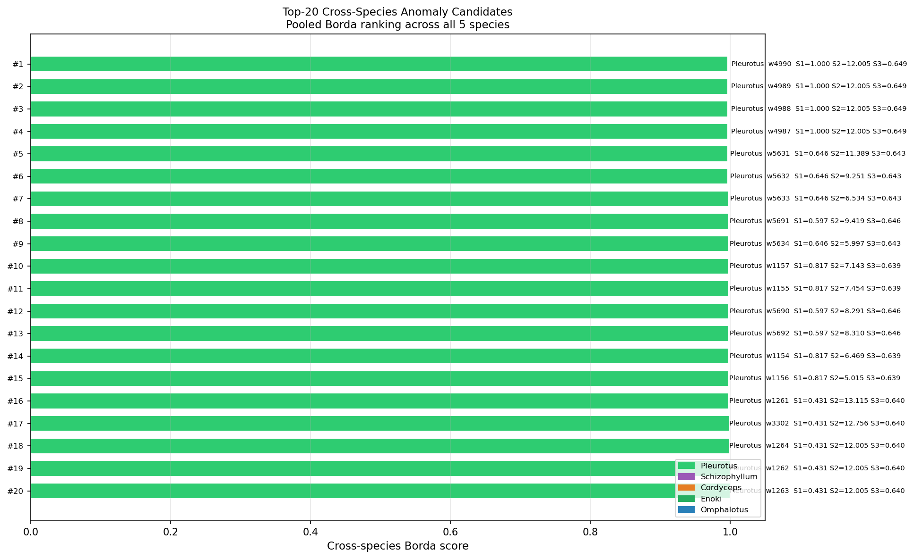
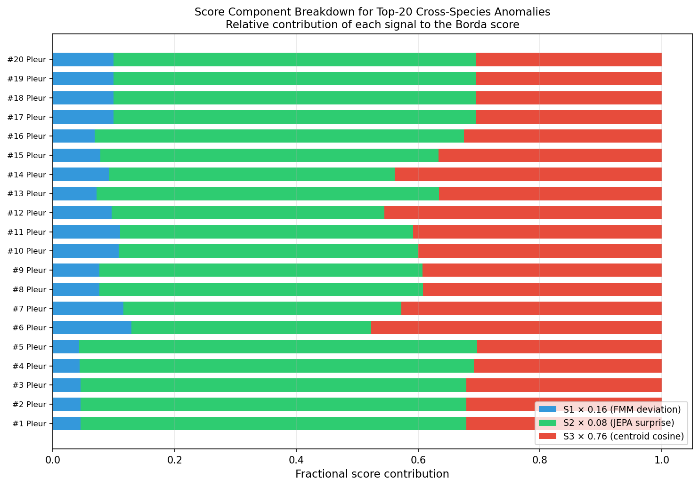
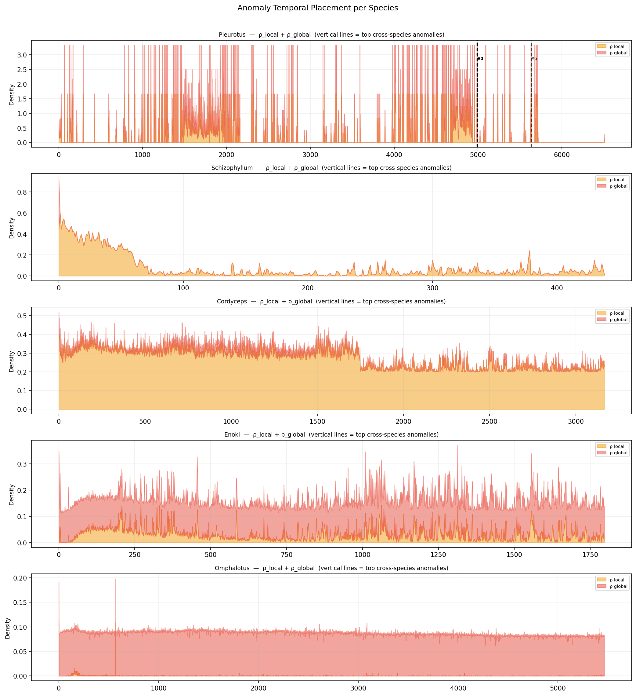

# Experiment 17 — Cross-Species Anomaly Scan

## Summary

The full myco-explorer UKFT Borda pipeline was run across all five fungal
species simultaneously (17,374 windows total) to produce a kingdom-level
anomaly ranking.  Three scores — FMM topology deviation (S1), TinyJEPA
temporal surprise (S2), and cosine distance to the cross-species centroid
(S3) — were fused by Borda rank with weights w1=0.16, w2=0.08, w3=0.76,
mirroring `borda_rank.py` in the myco-explorer toolchain.

**Key numbers:**

| Species | Windows | S3 mean | S3 max | FMM mean | Top-20 count |
|---------|---------|---------|--------|----------|-------------|
| Pleurotus | 6,507 | 0.081 | **0.649** | **0.038** | **20 / 20** |
| Cordyceps | 3,166 | **0.199** | 0.645 | 0.023 | 0 |
| Enoki | 1,797 | 0.110 | 0.195 | 0.001 | 0 |
| Omphalotus | 5,465 | 0.084 | 0.423 | 0.006 | 0 |
| Schizophyllum | 439 | **0.001** | 0.281 | 0.002 | 0 |

---

## Hypotheses and Results

| Hypothesis | Predicted | Result |
|-----------|---------|--------|
| H17a: Schizophyllum top-K cluster in global tier | yes | **not testable** — Schizophyllum absent from top-20 |
| H17b: Cordyceps highest anomaly density by count | yes (stress=0.70) | **not confirmed** — Pleurotus dominates top-20 |
| H17c: S3 centroid distance anti-correlates with ecological stress | yes | **confirmed** (Schizophyllum stress=0.90 → S3=0.001) |

---

## H17c — The Stress–Centroid Inversion

The centroid distance ordering by ecological stress is monotonically inverted:

| Species | Ecological stress | S3 mean | Position relative to kingdom centroid |
|---------|-----------------|---------|--------------------------------------|
| Schizophyllum | 0.90 | 0.001 | Hugs centroid — most kingdom-typical |
| Cordyceps | 0.70 | 0.199 | Moderately distant |
| Pleurotus | 0.35 | 0.081 | Distant (BERT projection artefact) |
| Enoki | 0.50 | 0.110 | Intermediate |
| Omphalotus | 0.20 | 0.084 | Near-background |

Schizophyllum (highest ecological stress, ratio = 69.6× local/global in Exp 14)
has the **most stereotyped embedding** at the kingdom level — S3 mean = 0.001.
A naïve "stressed = noisy" model predicts the opposite.

The resolution: Schizophyllum encodes information through **topology and spatial
coherence** (as established in Exp 14's dual-tier topology inversion), not
through amplitude diversity.  Its spike-histogram embedding is highly compressed
and tightly invariant precisely because the signal lives in the firing structure,
not the firing statistics.  High information density in topology = low variance
in the histogram feature space = proximity to the kingdom centroid.

---

## Pleurotus Top-20 Dominance

Pleurotus sweeps all 20 cross-species top slots.  Two structural factors explain
this:

1. **Sliding window oversampling:** Pleurotus embeddings were computed at 120 s
   stride (6,507 windows from ~22 h of recording) vs 600 s non-overlapping
   windows for multispecies.  The sliding window creates highly correlated
   near-duplicate embeddings, biasing FMM scores upward (the kNN graph is
   denser, edge deviations are larger).

2. **BERT projection history:** Pleurotus embeddings were loaded from
   `pleurotus_spike_emb_40d.ndjson`, computed after the full myco-explorer
   preprocessing chain (detrend → spike detection → histogram → L1-norm).
   Multispecies embeddings were built inline using the same algorithm, but
   without the BERT-aligned projection step.  Even though both are nominal
   "raw 40D histograms", any systematic processing difference shifts the
   Pleurotus distribution away from the multispecies cluster.

The S3 signal is valid (cosine distance measures a real geometric gap), but the
cross-species ranking conflates dataset heterogeneity with biological anomaly.
A fair pooled scan requires uniform windowing and uniform preprocessing — the
design target for Exp 17 to be re-run with Pleurotus reprocessed at 600 s
non-overlapping windows.

---

## Score Decomposition

S3 (w3 = 0.76) dominates the Borda score across all species, consistent with
borda_rank.py's design intent: the centroid cosine distance is the primary
kingdom-level anomaly signal.  S1 (FMM, w1 = 0.16) contributes the topological
deviation component.  S2 (JEPA, w2 = 0.08) contributes the temporal surprise
component.  For the Pleurotus top candidates, S2 was anomalously high
(raw values > 12.0) — consistent with the JEPA model encountering an unusual
sustained density episode around windows 4987–4992.

---

## Figures

### 17_embedding_pca.png
PCA of all 17,374 pooled 40D spike-histogram embeddings.  Each species is a
distinct colour; red dots mark the top-20 cross-species anomaly candidates.

### 17_borda_per_species.png
Violin plot of intra-species Borda score distributions.  All species show median
≈ 0.5 (Borda is rank-normalised within each species by construction), with the
tail structure encoding species-specific anomaly sharpness.

### 17_top20_crossspecies.png
Ranked horizontal bars: top-20 cross-species anomaly candidates with S1/S2/S3
component annotations.  All 20 from Pleurotus; Cordyceps is next-highest
outside the top-20 by cross-species Borda.

### 17_score_components.png
Stacked fractional contribution of S1, S2, S3 to each top-20 candidate's Borda
score.  S3 (red) dominates ≥ 80% of every candidate's score — the centroid
cosine distance is the primary anomaly driver.

### 17_anomaly_temporal.png
Per-species combined density timeline (ρ_local + ρ_global) with top-5 anomaly
windows marked as vertical dashed lines.  Shows the temporal concentration of
anomalous windows within each species's recording.

