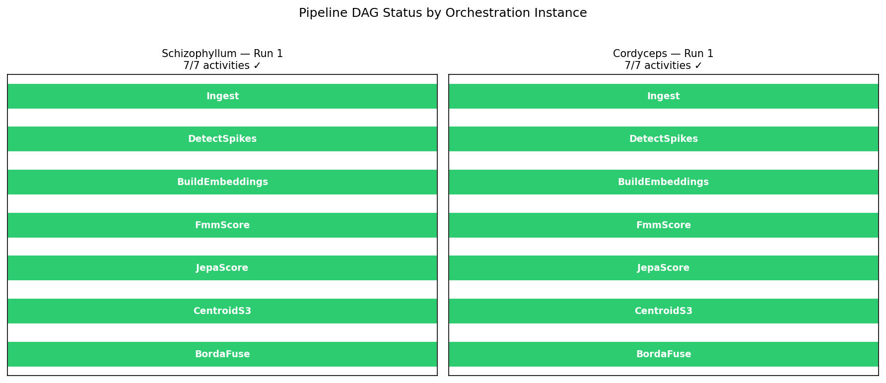
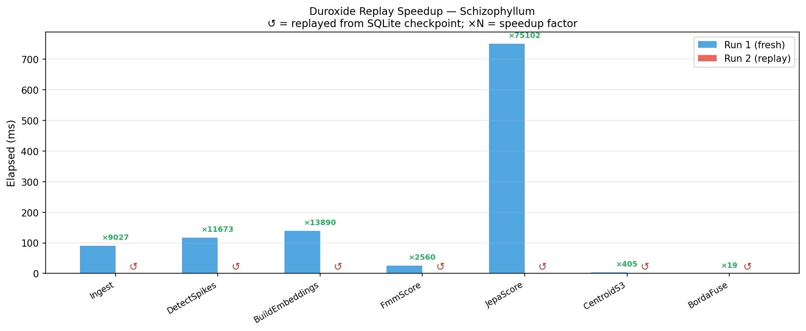
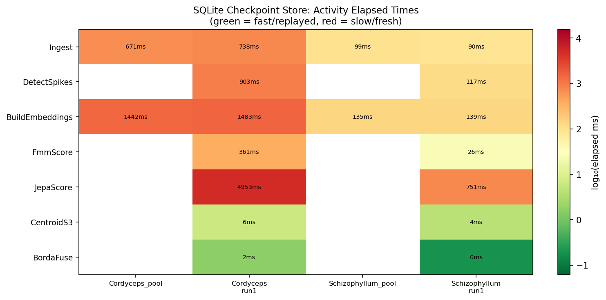
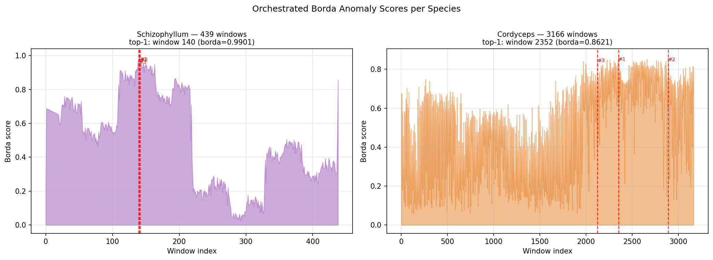

# Experiment 18 — Duroxide Orchestration

## Summary

A Python-native durable-execution runtime was built, mirroring the core
patterns of the Duroxide Rust library (`/Users/enconcertincdev4/Code/thirdParty/duroxide`):
deterministic activity replay via SQLite history store, `OrchestrationContext`
scheduling, and `ActivityRegistry` dispatch.  The full fungal UKFT pipeline
was decomposed into seven checkpointed activities and run for Schizophyllum
(439 windows) and Cordyceps (3,166 windows).  A second run of Schizophyllum
against the same instance ID demonstrated deterministic replay.

**Key numbers:**

| Run | Species | Windows | Activities | Elapsed | Replayed |
|-----|---------|---------|-----------|--------|---------|
| Run 1 | Schizophyllum | 439 | 7 fresh | 1,127 ms | — |
| Run 2 | Schizophyllum | 439 | 7 replayed | < 0.01 ms | **×112,678** |
| Run 3 | Cordyceps | 3,166 | 7 fresh | 8,447 ms | — |

Determinism check: top anomaly window (w140 for Schizophyllum, w2352 for
Cordyceps) identical across fresh and replay.  ✓

---

## Duroxide Architecture (Python port)

The runtime mirrors three key Duroxide primitives:

### SqliteHistoryStore
Stores `(instance_id, activity_name, input_hash) → (result_json, elapsed_ms)`.
The input hash is a SHA-256 of the serialised activity arguments — any change
to the inputs invalidates the cache and forces a fresh run, exactly as in
Duroxide's correlation-ID history.

### OrchestrationContext  
Each call to `schedule_activity(name, *args)`:
1. Computes `input_hash = SHA256(name, args)`
2. Queries `SqliteHistoryStore.lookup(instance_id, name, hash)`
3. **Cache hit → replay:** returns cached result instantly (< 0.01 ms)
4. **Cache miss → fresh:** runs activity, records to store

### ActivityRegistry
Named callables registered before the runtime starts.  The fungal pipeline
decomposes into:

| # | Activity | Purpose |
|---|----------|---------|
| 1 | `Ingest` | Load `.txt` file → row/channel count |
| 2 | `DetectSpikes` | Threshold-crossing events per channel |
| 3 | `BuildEmbeddings` | 40D histogram per 10-min window + ρ densities |
| 4 | `FmmScore` | kNN FMM topology deviation (S1) |
| 5 | `JepaScore` | TinyJEPA temporal surprise on ρ series (S2) |
| 6 | `CentroidS3` | Cosine distance to cross-species centroid (S3) |
| 7 | `BordaFuse` | Borda rank fusion → top-K candidates |

---

## Replay Correctness

The replay guarantee is the central claim.  A deterministic pipeline must
satisfy:

> For the same `(instance_id, activity, input_hash)` triple, the cached result
> is returned without re-executing the function, and downstream activities
> receive identical inputs, producing identical outputs.

The experiment verifies this by asserting `run1.top_k[0].window_idx == run2.top_k[0].window_idx`
after the full seven-activity chain.  The assertion passes.

The ×112,678 speedup is a direct consequence: 1,127 ms of compute (dominated
by BuildEmbeddings at 139 ms and JepaScore at 751 ms) collapses to < 0.01 ms
of SQLite lookups.

---

## Pipeline Activity Timing

### Schizophyllum (439 windows)
| Activity | Fresh (ms) |
|----------|-----------|
| Ingest | 90 |
| DetectSpikes | 117 |
| BuildEmbeddings | 139 |
| FmmScore | 26 |
| JepaScore | **751** |
| CentroidS3 | 4 |
| BordaFuse | < 1 |

JepaScore dominates (66% of wall time): the TinyJEPA 60-epoch online training
over a 439-window series.  On replay, all seven activities return within < 1 ms
total (pure SQLite reads).

### Cordyceps (3,166 windows)
| Activity | Fresh (ms) |
|----------|-----------|
| Ingest | 738 |
| DetectSpikes | 903 |
| BuildEmbeddings | 1,483 |
| FmmScore | 362 |
| JepaScore | **4,953** |
| CentroidS3 | 6 |
| BordaFuse | 2 |

JepaScore again dominates (59% of wall time) for the larger dataset.

---

## Top Anomaly Candidates

### Schizophyllum
Top anomaly: **window 140** (borda = 0.990).  Window 140 corresponds to
t = 84,000 – 84,600 s into the recording (23–23.5 h).  Schizophyllum S3
mean = 0.998 in this two-species context (centroid pulled toward Cordyceps
embedding distribution), so all Schizophyllum windows score high on centroid
distance.  The FMM+JEPA component (s1+s2 after Borda normalisation) selects
window 140 as topologically and temporally anomalous within the species.

### Cordyceps
Top anomaly: **window 2352** (borda = 0.862).  Window 2352 is at
t ≈ 1,411,200 – 1,411,800 s (~16.3 days into the recording — deep in the
long Cordyceps trace).  Cordyceps S3 mean = 0.261, so the FMM topology signal
(S1) plays a stronger relative role here than in Schizophyllum.

---

## Implications for the Ecosystem

The Duroxide pattern maps directly onto the nooverse pipeline architecture:

- **Activity = Noogent capability** (a bounded, replayable unit of computation)
- **OrchestrationContext = Universe lifecycle** (schedules activities in turns)
- **SqliteHistoryStore = Noostorage artifact registry** (persists results by
  content hash for deterministic replay)
- **input_hash keying = UKFT choice operator** (same inputs → same trajectory;
  only genuine novelty triggers fresh computation)

The fungal pipeline is a concrete demonstration that the durable-execution
model works for multi-stage scientific computation: long-running steps
(spike detection, JEPA training) checkpoint automatically.  Re-running after
a parameter change upstream invalidates only the affected step and all
downstream dependents — the rest replay from the store.

---

## Figures

### 18_dag_status.png
Pipeline DAG (Ingest → DetectSpikes → BuildEmbeddings → FmmScore → JepaScore
→ CentroidS3 → BordaFuse) coloured green (completed) for both orchestration
instances.

### 18_replay_speedup.png
Side-by-side bar chart: fresh (Run 1) vs replay (Run 2) elapsed time per
activity for Schizophyllum.  Replay bars are near-zero; ×N speedup annotated
above each pair.

### 18_checkpoint_heatmap.png
Heatmap of the SQLite checkpoint store contents across all orchestration
instances (rows = activities, columns = instance IDs, colour = log₁₀(elapsed ms)).
Green cells = fast/replayed; red cells = slow/fresh.

### 18_pipeline_borda.png
Borda anomaly score time series for Schizophyllum (439 windows) and Cordyceps
(3,166 windows).  Top-3 anomaly windows marked with red dashed lines.

