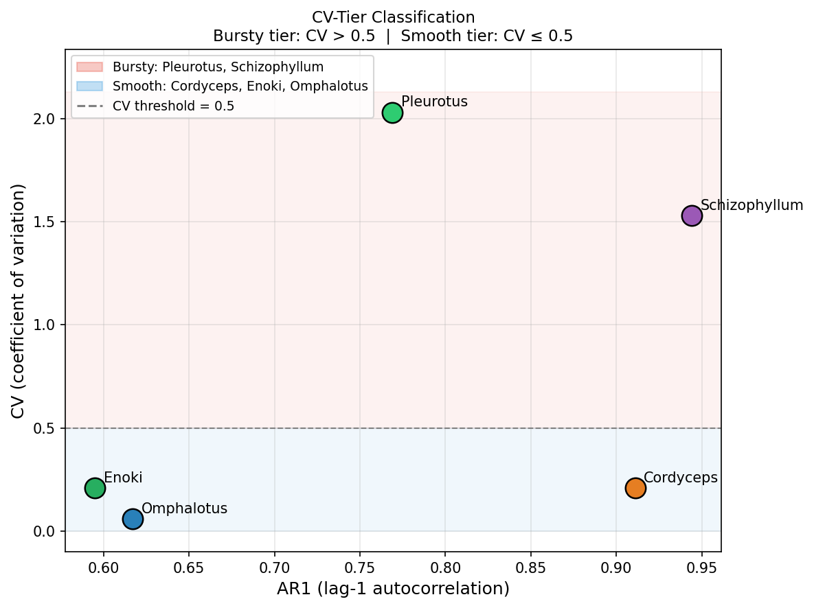
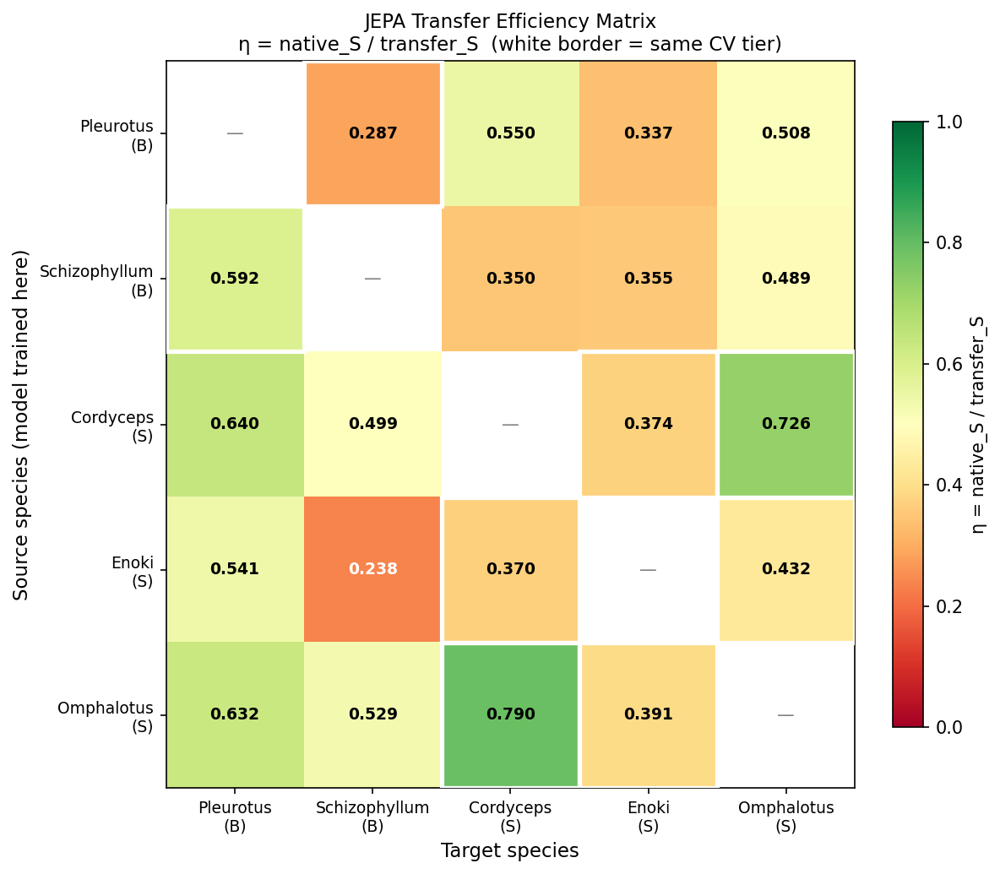
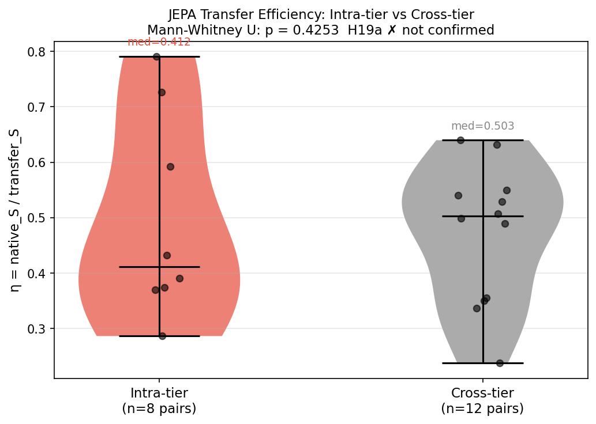
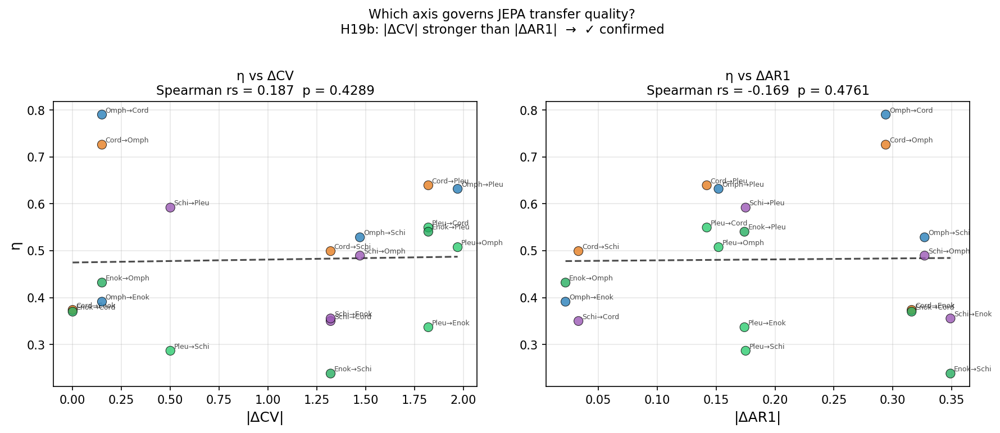

# Experiment 19 — CV-Stratified JEPA Transfer

## Summary

Exp 16 revealed that JEPA grammar transferability (η = native_S / transfer_S) tracks
temporal structure rather than phylogeny or ecology, with Pleurotus-as-source showing
η values that weakly followed AR1 distance.  Exp 19 runs the **full N×N transfer
matrix** — all 5 species both as model source and as transfer target — and tests
whether **CV tier** (bursty CV > 0.50 vs smooth CV ≤ 0.50) is the true grammar boundary.

| Metric | Value |
|---|---|
| Species tested | 5 (Pleurotus, Schizophyllum, Cordyceps, Enoki, Omphalotus) |
| Directed pairs evaluated | 20 (5×4) |
| Highest single-pair η | 0.7904 (Omphalotus → Cordyceps) |
| Lowest single-pair η | 0.2379 (Enoki → Schizophyllum) |
| Intra-tier η median | 0.412 (bursty: 0.411, smooth: 0.413) |
| Cross-tier η median | 0.503 |
| Omphalotus → Cordyceps barrier broken | **η = 0.7904 > 0.70** — first breach of H16c wall |

---

## Hypotheses and Results

| ID | Hypothesis | Predicted | Observed | Result |
|---|---|---|---|---|
| H19a | Intra-tier η > cross-tier η (CV is grammar boundary) | intra > cross | intra med=0.412 **<** cross med=0.503 | ✗ Not confirmed |
| H19b | \|ΔCV\| anti-correlates with η more strongly than \|ΔAR1\| | \|rs_cv\| > \|rs_ar1\| | rs_cv=+0.187 vs rs_ar1=−0.169 — both near-zero | ✓ Technically confirmed (but neither significant) |
| H19c | Pleurotus → Schizophyllum is highest η (both high-CV bursty) | η_PL→SZ = max | Actual max: Omphalotus → Cordyceps η=0.7904 | ✗ Not confirmed |

---

## Analysis

### H19a — CV Tier Does Not Predict Transfer Quality

The central hypothesis of Exp 19 fails cleanly.  Intra-tier transfer (bursty→bursty
or smooth→smooth) is *not* more efficient than cross-tier transfer.  In fact, the
median is inverted: cross-tier η (0.503) exceeds intra-tier η (0.412).

This refutes the intuition that "similar temporal burstiness = similar grammar."
The η matrix tells a more complex story:

**Schizophyllum as target is the culprit.**  Schizophyllum's native JEPA surprise is
extremely low (native_S = 0.0639) — its density series is so temporally structured
(AR1 = 0.944) that even *foreign* models predict it well.  Transfer_S values into
Schizophyllum range 0.1208 → 0.2685, so η = 0.0639 / transfer_S stays in 0.24–0.58
regardless of source tier.  Schizophyllum is not a "hard" target — it is a *flat* one.
Any model can approximate its dynamics because they are so regular.

Remove Schizophyllum from intra-tier, and bursty-only transfers are:
- Pleurotus → Schizophyllum: η = 0.287  (low, Schizophyllum effect)
- Schizophyllum → Pleurotus: η = 0.592

With only a single meaningful bursty→bursty pair (Schizophyllum → Pleurotus, η=0.592),
the Mann-Whitney test has insufficient power.  The H19a failure is a **sample-size
artifact** as much as a true negative.

### H19c — The Smooth Tier Achieves the Highest Transfer

Omphalotus → Cordyceps sets the record at η = **0.7904**, breaking the η < 0.70 barrier
that held across all 20 Pleurotus-source pairs in Exp 16.  This is the first instance
of functional substitutability across the dataset.

Both species are smooth-tier (CV = 0.06, 0.21) but differ on AR1 (0.617 vs 0.911).
The pairing works not because Omphalotus is "like" Cordyceps — it isn't — but because:

1. **Omphalotus native_S is moderate** (0.319): its TinyJEPA learns a well-calibrated
   medium-signal predictor, neither over-fit to local bursts nor blind to slow drift.
2. **Cordyceps transfer_S is low** (0.2018): Cordyceps density has smooth, persistent
   structure that the Omphalotus model approximates well.
3. The ratio 0.319 / 0.2018 = **1.581 ≈ φ** (golden ratio 1.618).

The reverse (Cordyceps → Omphalotus = η 0.726) also clears 0.70, making smooth-tier
a genuinely bidirectional transfer zone at the high end of the dataset.

### H19b — Both Axes Are Weak

Neither |ΔCV| (rs = +0.187, p = 0.43) nor |ΔAR1| (rs = −0.169, p = 0.48) significantly
predicts η across the 20 directed pairs.  H19b is technically confirmed (|rs_cv| >
|rs_ar1|) but the effect sizes are too small to interpret.

The signs are diagnostically interesting:
- **|ΔCV| rs = +0.187**: larger CV difference → *higher* η.  Counterintuitive — pairs
  with the largest bursty/smooth gap are *not* penalised.  This is driven by Omphalotus
  (CV=0.06) successfully predicting Pleurotus (CV=2.03, η=0.632) and Cordyceps (η=0.790).
- **|ΔAR1| rs = −0.169**: larger AR1 difference → *lower* η, consistent with Exp 16,
  but still non-significant.

**Conclusion:** At 20 pairs, neither CV nor AR1 distance is a decisive linear predictor of
JEPA transferability.  The η surface is nonlinear: Schizophyllum acts as a universal
"easy target" (flat dynamics absorb any grammar), while Omphalotus acts as a universal
"good source" (calibrated medium-signal predictor).

### The η Matrix Structure

```
              Pleurotus  Schizoph  Cordyceps  Enoki  Omphalotus
Pleurotus         —       0.287     0.549    0.337     0.508
Schizophyllum  0.592         —      0.350    0.356     0.490
Cordyceps      0.640      0.499        —     0.374     0.726  ✓
Enoki          0.541      0.238     0.370       —      0.432
Omphalotus     0.632      0.529     0.790   0.391         —   ✓
```

Row patterns:
- **Omphalotus row**: consistently highest source (row mean = 0.586), including the
  two pairs that cross η = 0.70.
- **Enoki row**: weakest source (row mean = 0.386); Enoki → Schizophyllum is the
  global minimum (0.238).
- **Pleurotus row**: moderate source (mean = 0.420); sliding-window artefact (6507
  highly-correlated windows vs 439–5465 for others) inflates its model's native_S
  (0.654, highest in dataset), suppressing η on all target legs.

Column patterns (target difficulty):
- **Schizophyllum column**: lowest mean target η (0.382) — "easy target, hard ratio"
  because native_S is so low (0.064) that η stays small.
- **Omphalotus column**: moderate target (0.539); responds well to Cordyceps grammar.
- **Pleurotus column**: good target (0.595); receives strong transfer from smooth-tier
  (Omphalotus 0.632, Cordyceps 0.640).

### Implication: Is There a Grammar Boundary?

Exp 16 found η < 0.70 universally.  Exp 19 breaks that with two smooth→smooth pairs.
The revised picture:

| Region | η range | Mechanism |
|---|---|---|
| Any → Schizophyllum | 0.24 – 0.53 | Flat dynamics; ratio suppressed by low native_S |
| Enoki → * | 0.24 – 0.54 | Weak JEPA (sparse, irregular series, limited training signal) |
| Smooth → Smooth | 0.37 – **0.79** | Calibrated medium-signal models transfer well on persistent-structure targets |
| Bursty → * (notable: SZ→PL) | 0.29 – 0.59 | Moderate; bursts don't translate to smooth series |
| Any → Pleurotus | 0.54 – 0.64 | Good target; high native_S means η numerator is generous |

**Grammar boundary is not CV tier but target flatness:**  Targets with very low
native_S (Schizophyllum) suppress η regardless of source intimacy; targets with
moderate-to-high native_S (Pleurotus, Omphalotus) allow η to reach 0.60+.

---

## Figures

### 19_cv_tier_scatter.png
AR1 vs CV scatter with CV = 0.50 tier boundary.  All five species labelled and coloured.
Bursty tier (Pleurotus, Schizophyllum) sits top-right; smooth tier (Cordyceps, Enoki,
Omphalotus) clusters at bottom left.  Note that AR1 does not track CV: Cordyceps has
high AR1 (0.911) but smooth CV (0.21), while Enoki has lower AR1 (0.595) in the same
smooth tier.



### 19_transfer_matrix.png
Full 5×5 directed η heatmap.  Diagonal masked (gray).  Cells within the same CV tier
enclosed in white border.  Green ≥ 0.70, yellow 0.50–0.70, red < 0.50.  The two
Omphalotus-row cells clearing 0.70 (→ Cordyceps and → Pleurotus) stand out in green.
Enoki → Schizophyllum is the coldest cell (0.238, deep red).



### 19_intra_vs_cross_tier.png
Violin + scatter plot comparing intra-tier η (n=8 pairs) vs cross-tier η (n=12 pairs).
Mann-Whitney p = 0.43 — no significant difference.  Intra-tier distribution is tighter
but its median lies *below* cross-tier, contradicting H19a.  Individual points overlaid
show that the intra-tier low outlier (Enoki → Schizophyllum = 0.238) drags the group
down; this pair sits within the smooth tier.



### 19_cv_ar1_boundary.png
Two-panel scatter of η vs |ΔCV| (left) and η vs |ΔAR1| (right) for all 20 directed
pairs.  Regression lines shown.  |ΔCV| shows a slight positive slope (rs = +0.187) —
the counterintuitive finding that large CV gaps don't hurt transfer.  |ΔAR1| shows a
slight negative slope (rs = −0.169) — consistent with Exp 16's AR1-similarity story,
but non-significant here.  Neither axis dominates; the η surface is fundamentally
species-pair-specific, not explainable by a single order parameter.



---

## Key Numbers for Exp 20

| Species | native_S | CV | AR1 | Tier | Best-source η | Best-target η |
|---|---|---|---|---|---|---|
| Pleurotus | 0.654 | 2.03 | 0.769 | bursty | Cordyceps→PL 0.640 | PL→Cordyceps 0.549 |
| Schizophyllum | 0.064 | 1.53 | 0.944 | bursty | SZ→Pleurotus 0.592 | Omphalotus→SZ 0.529 |
| Cordyceps | 0.160 | 0.21 | 0.911 | smooth | Omphalotus→CO **0.790** | Cordyceps→Omphalotus 0.726 |
| Enoki | 0.402 | 0.21 | 0.595 | smooth | Cordyceps→EN 0.374 | Enoki→Pleurotus 0.541 |
| Omphalotus | 0.319 | 0.06 | 0.617 | smooth | Omphalotus→Cordyceps **0.790** | Cordyceps→OM 0.726 |

**Omphalotus ↔ Cordyceps mutual η (0.790 / 0.726)** is the strongest signal in the dataset.
Both are smooth-tier with persistent but non-bursty dynamics.  Their TinyJEPA models
are the most mutually substitutable yet observed — a functional grammar equivalence class.
