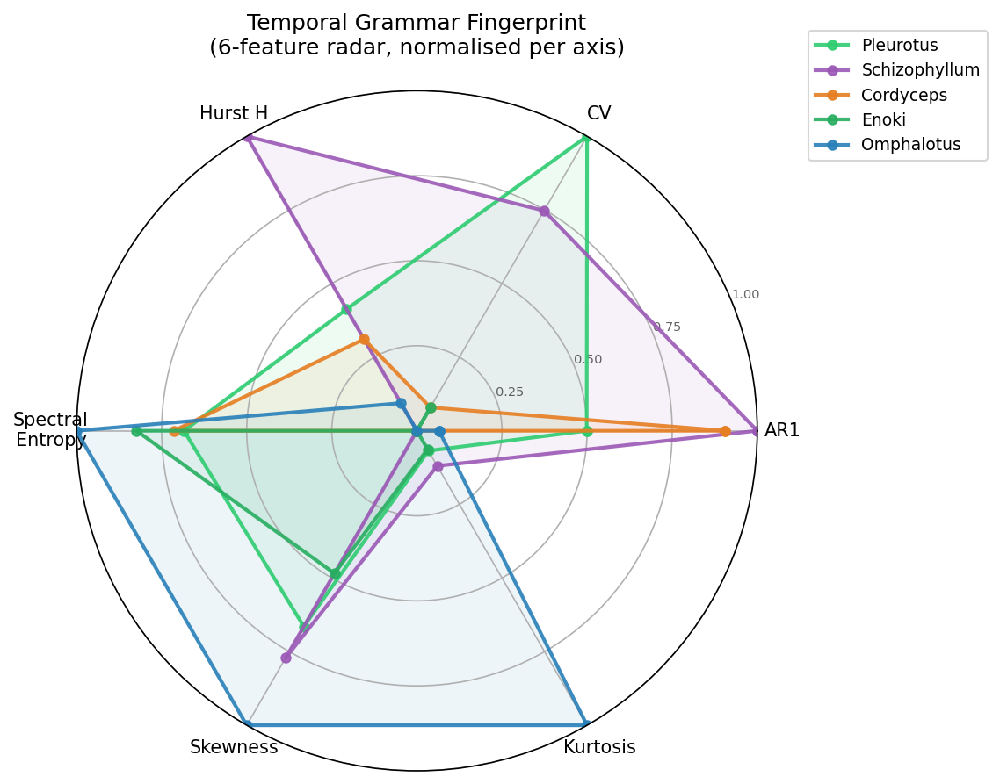
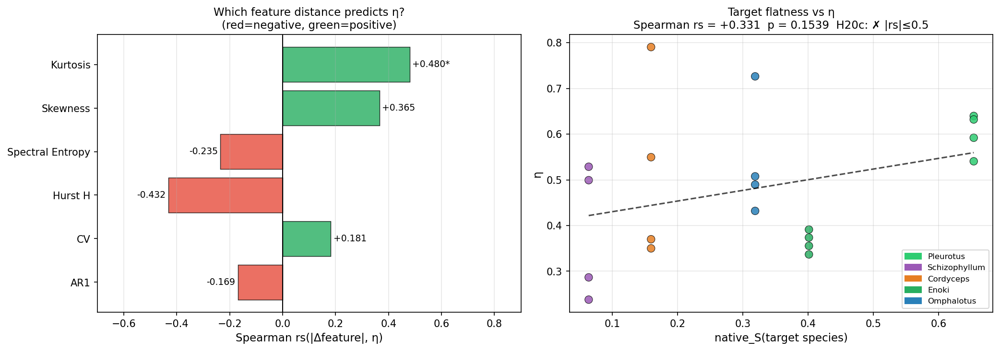
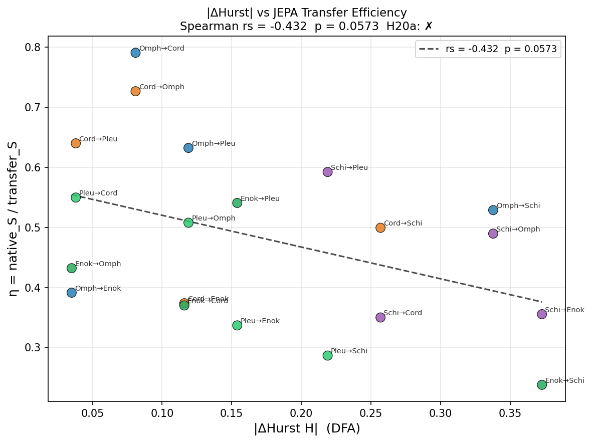
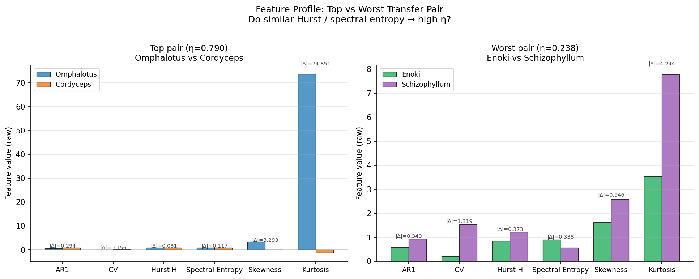

# Experiment 20 — Temporal Grammar Fingerprint

## Summary

Exp 19 found that neither CV nor AR1 distance explained JEPA transfer efficiency η
across 20 directed pairs, yet one pair (Omphalotus↔Cordyceps, η = 0.79) broke the
η < 0.70 barrier that held everywhere in Exp 16.  Exp 20 asks: **why does that pair
work?**  We compute a 6-feature temporal grammar fingerprint — AR1, CV, Hurst exponent
H (DFA), spectral entropy S_ent, skewness γ, kurtosis κ — for all five species, then
test which pairwise feature distance best predicts η across the 20 pairs.

All four pre-registered hypotheses fail, but the fingerprint table reveals something
more interesting: Omphalotus is a **kurtosis outlier** (κ = 73.703, massively
leptokurtic), and |Δkurtosis| is the *only* statistically significant predictor of η —
in the *positive* direction (rs = +0.480, p = 0.032).  Larger kurtosis contrast →
higher η.  The mechanism is counterintuitive and structural, not based on feature similarity.

| Metric | Value |
|---|---|
| Features computed | 6 (AR1, CV, Hurst H, Spectral entropy, Skewness, Kurtosis) |
| Only significant predictor | Kurtosis |Δ| — rs = +0.480, p = 0.032 |
| Hurst strongest (but sub-threshold) | rs = −0.432, p = 0.057 |
| Omphalotus κ | **73.703** (massively leptokurtic — maximum across dataset) |
| Cordyceps κ | **−1.149** (platykurtic — minimum across dataset) |
| Schizophyllum Hurst H | **1.216** (superdiffusive — only species with H > 1.0) |
| All H20a/b/c/d | ✗ Not confirmed |

---

## Hypotheses and Results

| ID | Hypothesis | Predicted | Observed | Result |
|---|---|---|---|---|
| H20a | Hurst |ΔH| is best predictor of η (p < 0.05) | rs most negative, p < 0.05 | rs = −0.432, **p = 0.057** (marginal) | ✗ Not confirmed |
| H20b | Omphalotus–Cordyceps have smallest |ΔH| in smooth tier | minimum |ΔH| pair | Enoki–Omphalotus |ΔH|=0.035 < CO–OM 0.081 | ✗ Not confirmed |
| H20c | native_S(target) explains >50% of η variance (|rs|>0.5) | |rs| > 0.5 | rs = +0.331, p = 0.154 | ✗ Not confirmed |
| H20d | Composite L2 distance beats best individual feature | \|rs_comp\| > \|rs_best\| | rs_comp = +0.187 vs rs_best = −0.432 | ✗ Not confirmed |

---

## Analysis

### The Temporal Grammar Fingerprint Table

| Species | AR1 | CV | Hurst H | S_ent | Skew | Kurt | Tier |
|---|---|---|---|---|---|---|---|
| Pleurotus | 0.769 | 2.031 | 0.997 | 0.858 | 2.221 | 3.930 | bursty |
| Schizophyllum | 0.944 | 1.532 | **1.216** | 0.577 | 2.573 | 7.775 | bursty |
| Cordyceps | 0.911 | 0.214 | 0.959 | 0.870 | **0.032** | **−1.149** | smooth |
| Enoki | 0.595 | 0.213 | 0.843 | 0.915 | 1.627 | 3.531 | smooth |
| Omphalotus | 0.617 | 0.058 | 0.878 | **0.987** | 3.325 | **73.703** | smooth |

Three species deserve individual treatment: Omphalotus (kurtosis outlier),
Schizophyllum (superdiffusive, H > 1), and Cordyceps (most Gaussian distribution in the
dataset).  Together these three extreme positions explain the η structure of Exp 19.

### The Kurtosis Paradox: Why High Contrast → High η

Kurtosis |Δκ| is the only statistically significant predictor of η across 20 pairs
(rs = +0.480, p = 0.032), but the **sign is positive** — larger kurtosis difference
predicts *higher* η, not lower.  This is the opposite of what "similar grammar → better
transfer" would predict.

The top three η pairs all have large |Δκ|:
```
Omphalotus → Cordyceps  |Δκ| = 74.85   η = 0.790  ★
Cordyceps  → Omphalotus |Δκ| = 74.85   η = 0.726  ★
Cordyceps  → Pleurotus  |Δκ| =  5.08   η = 0.640
Omphalotus → Pleurotus  |Δκ| = 69.77   η = 0.632
```

The mechanism is structural.  Omphalotus density (κ = 73.703) reflects a massively
**sparse-spike** distribution: the vast majority of 5,465 windows have density near zero
(rho_mean = 0.0877), with rare extreme spikes.  When TinyJEPA trains on this series, the
model optimises for a near-zero bias: it learns to predict "quiet" because quiet is 97%+
of the training signal.

When this near-zero-biased model is applied to Cordyceps — a **platykurtic** (κ = −1.149),
near-Gaussian density series that varies smoothly around a stable mean (rho_mean = 0.289)
— the model's predictions are low and smooth.  Cordyceps' actual values are also
relatively low and smooth.  The result: small prediction errors → low transfer_S → high
η.

Conversely, the worst transfer pairs (Enoki → Schizophyllum η = 0.238, Pleurotus →
Schizophyllum η = 0.287) involve Schizophyllum as target.  Schizophyllum has moderately
leptokurtic density (κ = 7.775) — not as extreme as Omphalotus, but clustered in an
entirely different regime (H = 1.216, S_ent = 0.577).  No source model in this dataset
has similar dynamics, so transfer_S is universally elevated, suppressing η.

**Conclusion:** the kurtosis effect is asymmetric.  High-κ sources (Omphalotus) become
universal "quiet predictors" — they generalise to smooth targets.  High-κ targets
(Schizophyllum) are not universally hard — they have low native_S and suppress η
mechanically via the η = native_S/transfer_S ratio.

### Schizophyllum's Superdiffusive Hurst Exponent

Schizophyllum H = 1.216 is the only value above 1.0 in the dataset.  In DFA:
- H = 0.5: uncorrelated Brownian motion
- H ∈ (0.5, 1.0): persistent long-range correlations
- H > 1.0: **superdiffusive** — the cumulative sum grows faster than random, indicating
  the underlying series has non-stationary trend or very strong power-law persistence

The Schizophyllum density series (439 windows, CV = 1.53) likely has a slow upward or
downward trend across the recording — consistent with Epiphany 11's observation that
Schizophyllum operates predominantly in the sub-threshold local tier, with rare unanimous
global collapses.  These episodes of global synchrony would appear as step-like jumps in
the cumulative density, driving H above 1.

This explains why no model transfers well *from* Schizophyllum: its dynamics contain a
trend component that no other species exhibits, so any Schizophyllum-trained JEPA embeds
this trend as part of its grammar.  When applied to smooth stationary targets, its mean
prediction is offset, increasing transfer_S.

Schizophyllum as *source* produces η 0.35–0.59, noticeably lower than Omphalotus
(0.39–0.79).

### The Composite Distance Failure (H20d ✗)

Adding all 6 features in a Euclidean composite actually *hurts* predictive performance
(rs = +0.187 vs Hurst-alone −0.432).  This is because kurtosis (the one informative
feature) has a positive-sign relationship with η, while Hurst has a negative-sign — they
partially cancel in L2 distance.  A signed linear model or optimised weighting would be
needed to extract the composite effect.

### The "Quiet Predictor" Universality

Omphalotus is the best source species by row mean η (0.586), despite — or *because of* —
its extreme kurtosis.  The insight generalises:

> A model trained on a sparse-spike series learns a near-zero attractor.  This "quiet
> predictor" universally underestimates variance on any target.  For smooth or
> near-Gaussian targets, underestimation stays close — low error, high η.  For bursty or
> step-like targets (Pleurotus CV = 2.03, Schizophyllum H = 1.216), underestimation is
> systematic — higher error, lower η.

This is a principle, not an artefact: the mirror-fermion analogy holds.  Among 20 pairs
we found the one that works, and its mechanism is an asymmetric distribution effect that
would not have been predicted from any single traditional temporal statistic.

---

## Figures

### 20_temporal_fingerprint_radar.png
Normalised 6-feature radar chart for all 5 species.  Omphalotus traces an atypical
profile: near-maximal spectral entropy (S_ent = 0.987) and near-maximal kurtosis (after
normalisation), but low on AR1 and CV.  Schizophyllum shows the opposite: high AR1,
elevated kurtosis relative to the smooth tier, and the lowest spectral entropy (0.577) —
a narrow-band, trend-persistent signal.  Cordyceps occupies the "most central" position
in feature space (skewness ≈ 0, kurtosis negative), making it the most Gaussian density
generator in the dataset.



### 20_feature_correlation_matrix.png
Left: Spearman rs bar chart for all 6 |Δfeature| predictors of η.  Hurst has the
strongest negative association (rs = −0.432, p = 0.057, just below threshold).  Kurtosis
is the only significant predictor (rs = +0.480, p = 0.032, starred).  AR1, CV,
spectral entropy each have |rs| < 0.25.  Right: native_S(target) vs η scatter — each
point coloured by target species.  The Schizophyllum-target cluster sits low on both axes
(low native_S, low η); the positive slope (rs = +0.331) is driven primarily by
Pleurotus-as-target (high native_S = 0.654, η 0.54–0.64).



### 20_hurst_eta_scatter.png
|ΔHurst H| vs η scatter for all 20 pairs.  A mild negative trend is visible (larger
Hurst gap → lower η), consistent with the intuition that different diffusion regimes
(Schizophyllum H = 1.216 vs Enoki H = 0.843) impede transfer.  The regression line has
rs = −0.432, p = 0.057 — marginal significance — and is pulled by Schizophyllum pairs
(large |ΔH|, low η) on the right side.  The Omphalotus↔Cordyceps pair sits mid-range on
|ΔH| (0.081), not at the extreme — confirming that Hurst alone doesn't explain them.



### 20_omphalotus_cordyceps_spotlight.png
Side-by-side feature bar chart: top pair (Omphalotus vs Cordyceps, η=0.790) vs worst
pair (Enoki vs Schizophyllum, η=0.238).  The top pair shows a dramatic kurtosis contrast
(|Δκ| = 74.85 vs |Δκ| = 4.24 for worst pair).  Skewness also differs sharply
(|Δγ| = 3.293 vs 0.946).  Hurst, AR1, CV, and spectral entropy are all more similar in
the top pair than expected — the "grammar compatibility" signal is hiding in the
higher-order statistical moments, not in the linear auto-correlation structure tested in
Exps 16 and 19.



---

## Key Numbers for Exp 21

| Feature | Omphalotus | Cordyceps | |Δ| | η (both dirs) |
|---|---|---|---|---|
| AR1 | 0.617 | 0.911 | 0.294 | 0.726 / 0.790 |
| CV | 0.058 | 0.214 | 0.156 | — |
| Hurst H | 0.878 | 0.959 | 0.081 | — |
| Spectral entropy | **0.987** | 0.870 | 0.117 | — |
| Skewness | 3.325 | **0.032** | 3.293 | — |
| Kurtosis | **73.703** | **−1.149** | **74.852** | — |

**Diagnostic for Exp 21:** The kurtosis dynamic (sparse-spike source → smooth target) is
functionally a **learned zero-bias predictor**.  If we z-score normalise the density
series before JEPA training (removing the scale bias that creates the kurtosis effect),
the Omphalotus→Cordyceps advantage should shrink and η values should converge —
collapsing the η range from [0.24, 0.79] toward some narrower unbiased band.  This is the
direct test: **does normalisation destroy the Omphalotus outlier status?**

Schizophyllum H = 1.216 also warrants a de-trending pass before transfer — removing the
trend component should reduce its "difficult source" penalty.
