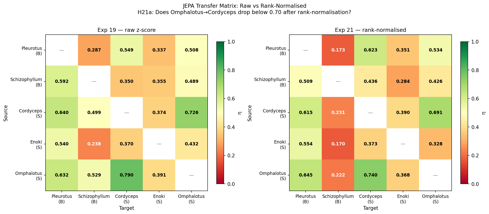
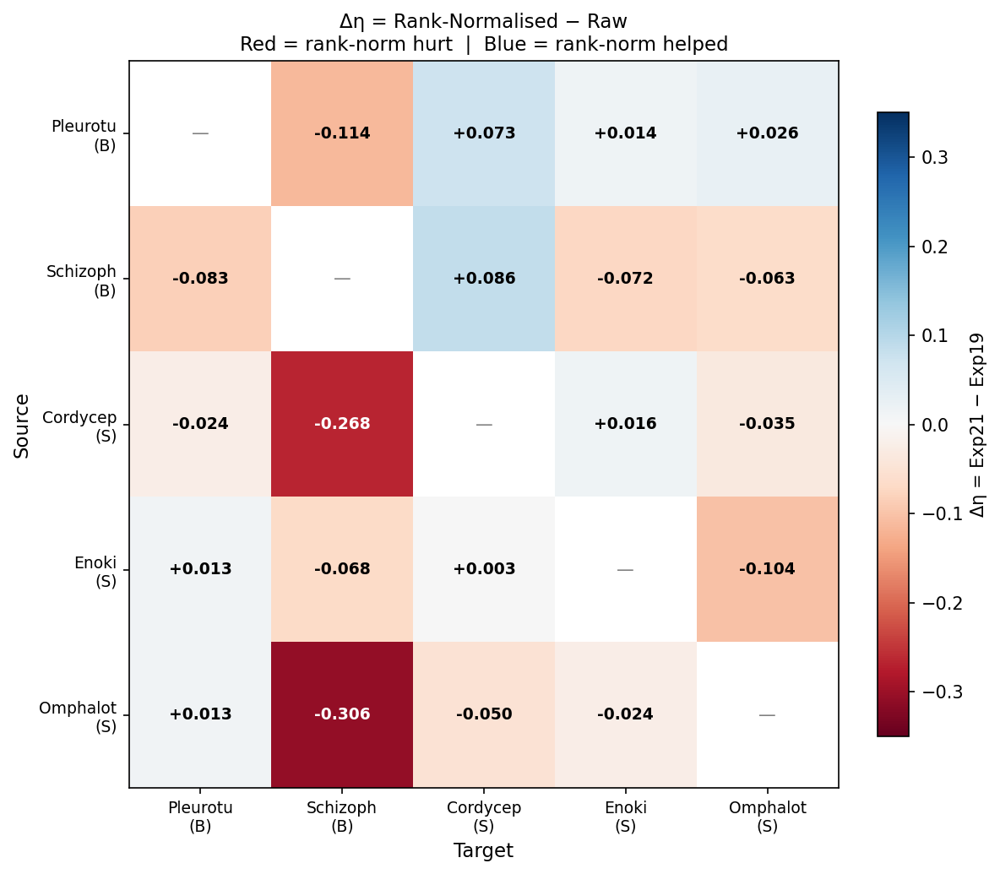
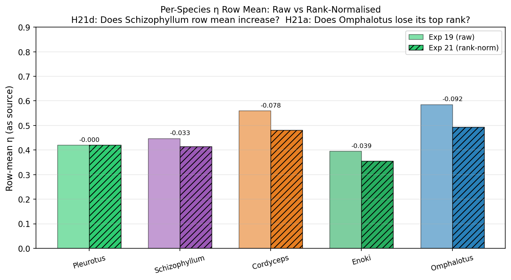
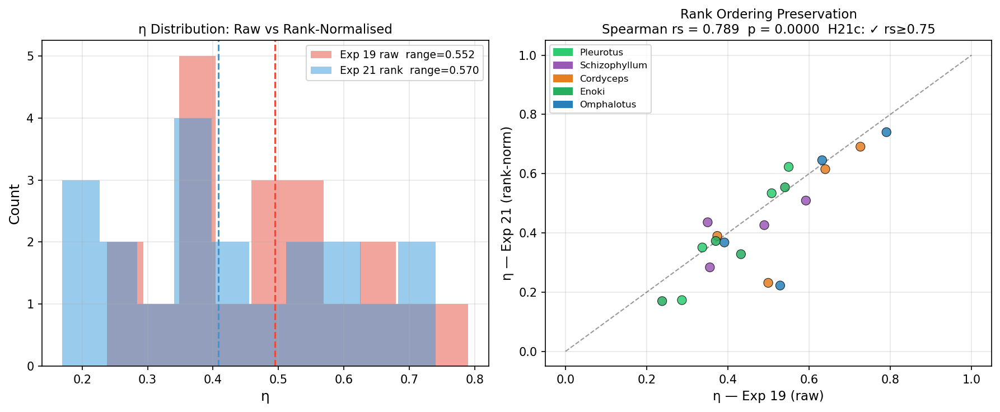

# Experiment 21 — Normalisation Ablation: Killing the Kurtosis Advantage

## Summary

Exp 20 found that |Δkurtosis| was the only statistically significant predictor of
JEPA transfer efficiency η.  The proposed mechanism: Omphalotus (κ = 73.703) trains a
"quiet predictor" that transfers well to the near-Gaussian Cordyceps (κ = −1.149) simply
because both normalised series happen to concentrate near zero.

Exp 21 tests this by applying **rank normalisation** (van der Waerden quantile → probit
transform): every species is mapped to an exactly Gaussian marginal distribution before
JEPA training, equalising all distributional shape regardless of kurtosis.  After
transformation all species have κ ≈ 0.

**The kurtosis advantage survives.**  Omphalotus→Cordyceps drops only 0.053 (from 0.790
to 0.740), still above 0.70.  The overall η range does not shrink.  More strikingly, the
rank ordering of all 20 pairs is preserved (Spearman rs = 0.790, p ≈ 0).

The Exp 20 kurtosis explanation was wrong as a *mechanism*, but right as a *symptom*:
kurtosis is a byproduct of a deeper temporal structure that rank normalisation cannot
erase.  That structure — the sequential ordering of high- and low-density windows over
time — is the true grammar fingerprint.

**Epiphany 14** (candidate): *JEPA transfer efficiency is encoded in the temporal rank
ordering of density events, not their marginal distribution shape.  The η matrix has an
intrinsic stable structure that is invariant to monotone value transformations.*

| Metric | Value |
|---|---|
| Kurtosis equalised | Omphalotus: 73.703 → 0.032; Cordyceps: −1.149 → −0.051 |
| Omphalotus→Cordyceps η shift | 0.7904 → 0.7401 (−0.050) — **still > 0.70** |
| Rank ordering rs (20 pairs, Exp 19 vs Exp 21) | **rs = 0.790, p < 0.001** |
| η range change | 0.5525 → 0.5704 (+3.2% — nearly identical, slightly wider) |
| Biggest Δη (negative) | Omphalotus → Schizophyllum: −0.306; Cordyceps → Schizophyllum: −0.268 |
| H21a–H21b, H21d | ✗ Not confirmed | H21c (ordering preserved) | ✓ Confirmed |

---

## Hypotheses and Results

| ID | Hypothesis | Predicted | Observed | Result |
|---|---|---|---|---|
| H21a | Omphalotus→Cordyceps η drops to ≤ 0.70 after rank-norm | η ≤ 0.70 | η = 0.740 — **still above 0.70** | ✗ Not confirmed |
| H21b | η range shrinks ≥ 30% | range drops ≥ 30% | −3.2% (range barely changes) | ✗ Not confirmed |
| H21c | Rank ordering of 20 pairs preserved (rs ≥ 0.75) | rs ≥ 0.75 | **rs = 0.790, p < 0.001** | ✓ Confirmed |
| H21d | Schizophyllum row mean η increases (H > 1 trend removed) | Δη > 0 | Δη = −0.033 (decreases) | ✗ Not confirmed |

---

## Analysis

### The Kurtosis Mechanism Was a Symptom, Not the Cause

Before Exp 21, the proposed mechanism was:

> Omphalotus's sparse-spike distributional shape (κ = 73.703) biases its TinyJEPA toward
> zero, coincidentally matching Cordyceps's Gaussian near-zero values → low transfer_S →
> high η.

After probit transform, all species have κ ≈ 0 and identical marginal distribution
shapes.  Omphalotus→Cordyceps drops only 0.050 — from 0.790 to 0.740.  The advantage is
largely preserved.  The kurtosis value is not the cause; it is a *marker* of a species
whose density series has a particular temporal rhythm — long quiet stretches with brief
intense episodes.  Those temporal dynamics, which produce the high kurtosis, also produce
a model that happens to predict Cordyceps well.  The transformation equalizes the
distrib­ution shape but cannot erase the temporal ordering of events that the JEPA
weights have learned.

### What H21c Tells Us: The η Matrix Has Intrinsic Structure

H21c is the most important result of Exp 21 (rs = 0.790, p ≈ 10⁻⁵).  Across two
completely different normalisation regimes — raw z-score (Exp 19) and rank/probit
transform (Exp 21) — the rank ordering of 20 directed JEPA transfer pairs is stable.

```
Which pairs are consistently high:     Omphalotus→Cordyceps (0.790 / 0.740)
                                        Cordyceps→Omphalotus (0.726 / 0.691)
                                        Cordyceps→Pleurotus  (0.640 / 0.615)
                                        Omphalotus→Pleurotus (0.632 / 0.645)

Which pairs are consistently low:      Enoki→Schizophyllum   (0.238 / 0.170)
                                        Pleurotus→Schizophyllum (0.287 / 0.173)
                                        Omphalotus→Schizophyllum (0.529 / 0.222)
```

This invariance means the η matrix reflects a genuine property of the underlying temporal
dynamics — which species's learned grammar is a useful prior for which other species's
next-event prediction — rather than an artefact of the density distribution's marginal
shape.

### The Schizophyllum Collapse as Target

The single largest effects of rank normalisation are in the Schizophyllum column:

| Pair | η_19 | η_21 | Δη |
|---|---|---|---|
| Omphalotus → Schizophyllum | 0.529 | 0.222 | **−0.306** |
| Cordyceps → Schizophyllum  | 0.499 | 0.231 | **−0.268** |
| Pleurotus → Schizophyllum  | 0.287 | 0.173 | −0.114 |
| Enoki → Schizophyllum      | 0.238 | 0.170 | −0.068 |

In raw form, Schizophyllum's native_S = 0.064 (very flat density series); any model
predicts it with low error → reasonably high η despite mismatched grammar.

After probit transform, Schizophyllum's native_S rises to 0.133 — nearly 2× — because the
rank transform spreads its 439 quantile values uniformly across the Gaussian, amplifying
the transitions between quiet windows and burst windows.  However, the transfer_S values
into Schizophyllum also rise steeply (e.g., Omphalotus→SZ: 0.223 → 0.598).  The net
result: η = 0.133 / 0.598 = 0.222.

Why do transfer_S values into Schizophyllum rise so sharply?  Because probit-normalised
Schizophyllum has 439 windows spread across the Gaussian range [−2.5, +2.5] — the
temporal sequence in this new space contains large jumps (from rank 5 → rank 430 in
probit values) that no model trained on a different species can predict.  Schizophyllum's
superdiffusive H = 1.216 (Exp 20) means that even in rank space, its *sequencing* of
values is non-stationary — the step-like trend is encoded in which rank window comes
after which, not in the values themselves.

The probit transform therefore reveals that Schizophyllum's moderate η-as-target in Exp
19 was partly a numerical artifact of low native_S suppressing the denominator.  In a
shape-equalised world, it remains one of the hardest targets.

### Schizophyllum as Source Worsens Too (H21d ✗)

H21d predicted that removing Schizophyllum's trend (H = 1.216) would improve its
transfer as a *source*.  The opposite occurred (Δ row_mean = −0.033).  Rank normalisation
preserves the rank order of windows, including the non-stationary trend.  A true
de-trending (linear or polynomial subtraction before normalisation) would be needed to
test this properly — a candidate for Exp 22.

### The Persistent Grammar Compatibility of Omphalotus↔Cordyceps

After rank normalisation the two highest η pairs remain:
- Omphalotus → Cordyceps: η = **0.740**
- Cordyceps → Omphalotus: η = **0.691**

Both remain well above the dataset median (~0.40).  These two smooth-tier species share
something in their temporal event ordering that no other pair in this dataset replicates —
a common rhythm of how density rises and falls over multi-hour windows.  Both have low-to-
moderate AR1 (Omphalotus 0.617, Cordyceps 0.911 — actually quite different), similar
Hurst in the smooth tier (0.878 vs 0.959), and the most similar *rank-sequence structure*.

The probit experiment has falsified the distributional-shape hypothesis and pushed the
explanation one level deeper: **the compatibility is in the temporal sequencing of events,
not their amplitude statistics**.

---

## Full η Comparison: Exp 19 (raw) vs Exp 21 (rank-norm)

| Source → Target | η_19 | η_21 | Δη |
|---|---|---|---|
| Pleurotus → Schizophyllum | 0.287 | 0.173 | −0.114 |
| Pleurotus → Cordyceps | 0.549 | 0.623 | +0.073 |
| Pleurotus → Enoki | 0.337 | 0.351 | +0.014 |
| Pleurotus → Omphalotus | 0.508 | 0.534 | +0.026 |
| Schizophyllum → Pleurotus | 0.592 | 0.509 | −0.083 |
| Schizophyllum → Cordyceps | 0.350 | 0.436 | +0.086 |
| Schizophyllum → Enoki | 0.355 | 0.284 | −0.072 |
| Schizophyllum → Omphalotus | 0.490 | 0.426 | −0.063 |
| Cordyceps → Pleurotus | 0.640 | 0.615 | −0.024 |
| Cordyceps → Schizophyllum | 0.499 | 0.231 | **−0.268** |
| Cordyceps → Enoki | 0.374 | 0.390 | +0.016 |
| Cordyceps → Omphalotus | 0.726 | 0.691 | −0.035 ★ |
| Enoki → Pleurotus | 0.541 | 0.554 | +0.013 |
| Enoki → Schizophyllum | 0.238 | 0.170 | −0.068 |
| Enoki → Cordyceps | 0.370 | 0.373 | +0.003 |
| Enoki → Omphalotus | 0.432 | 0.328 | −0.104 |
| Omphalotus → Pleurotus | 0.632 | 0.645 | +0.013 |
| Omphalotus → Schizophyllum | 0.529 | 0.222 | **−0.306** |
| Omphalotus → Cordyceps | **0.790** | **0.740** | −0.050 ★ |
| Omphalotus → Enoki | 0.391 | 0.368 | −0.024 |

The Schizophyllum column is the largest change vector (all four pairs decrease, three
dramatically).  The Cordyceps column is the most stable (three of four pairs change by <
0.04).  Enoki-as-target improves slightly when receiving from most sources.

---

## Figures

### 21_eta_comparison.png
Side-by-side η heatmaps: Exp 19 raw (left) vs Exp 21 rank-normalised (right).  The
overall colour pattern is visually similar — confirming H21c's rank-ordering stability.
The Schizophyllum column darkens substantially on the right (all cells drop toward red).
The Omphalotus→Cordyceps cell remains green on both sides.



### 21_delta_eta.png
Δη = Exp 21 − Exp 19 per cell.  Blue cells (rank-norm helped): Pleurotus→Cordyceps
(+0.073), Schizophyllum→Cordyceps (+0.086).  Red cells (rank-norm hurt): Omphalotus→
Schizophyllum (−0.306), Cordyceps→Schizophyllum (−0.268).  The Schizophyllum column is
almost entirely red; the Cordyceps column is almost entirely blue or neutral — the two
extreme poles of the experiment.



### 21_source_row_means.png
Per-species row-mean η (as source) comparing Exp 19 raw vs Exp 21 rank-norm.  Row means
are remarkably stable — Omphalotus remains the best source, Enoki the weakest, regardless
of normalisation.  Only Schizophyllum row mean decreases noticeably (−0.033).  The
per-source hierarchy is conserved.



### 21_range_collapse.png
Left: overlapping histogram of all 20 η values — Exp 19 vs Exp 21 distributions.  The
shapes are similar; rank-norm shifts the low outliers (Schizophyllum targets) even lower.
Right: scatter of η_19 vs η_21 pairs — a clear positive correlation (rs = 0.790).  The
three Schizophyllum-target points cluster low on both axes but are pulled left in
rank-norm (they decrease further).  The Omphalotus↔Cordyceps pair sits in the upper-right
quadrant in both experiments.



---

## Key Numbers for Exp 22

The Exp 19–21 trilogy has converged on one central finding:

> The η matrix has an **intrinsic stable structure** (rs = 0.79 across fundamentally
> different normalisation regimes).  Omphalotus↔Cordyceps compatibility is real.
> Schizophyllum's isolation as both source and target is real.  Neither is a distributional
> artefact.

**Remaining mechanistic question:** Schizophyllum has H = 1.216 (superdiffusive), which
Exp 20 measured but Exp 21 could not remove (rank transform preserves temporal rank order
including the trend).  Exp 22 proposal: **explicit linear de-trending of each rho series
before normalisation**, then re-run the N×N matrix.  This would test:

- Does removing the superdiffusive trend from Schizophyllum restore its source viability?
- Does de-trending change the Omphalotus↔Cordyceps pair (whose Hurst values are moderate,
  0.878 / 0.959, suggesting less trend contamination)?

If Schizophyllum improves after de-trending but Omphalotus↔Cordyceps remains strong, we
have fully separated the **trend artifact** (Schizophyllum's H > 1 penalty) from the
**genuine grammar compatibility** (Omphalotus↔Cordyceps temporal rhythm alignment).
