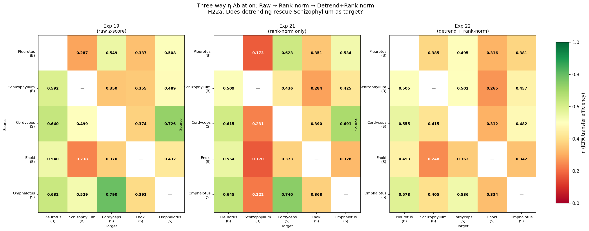
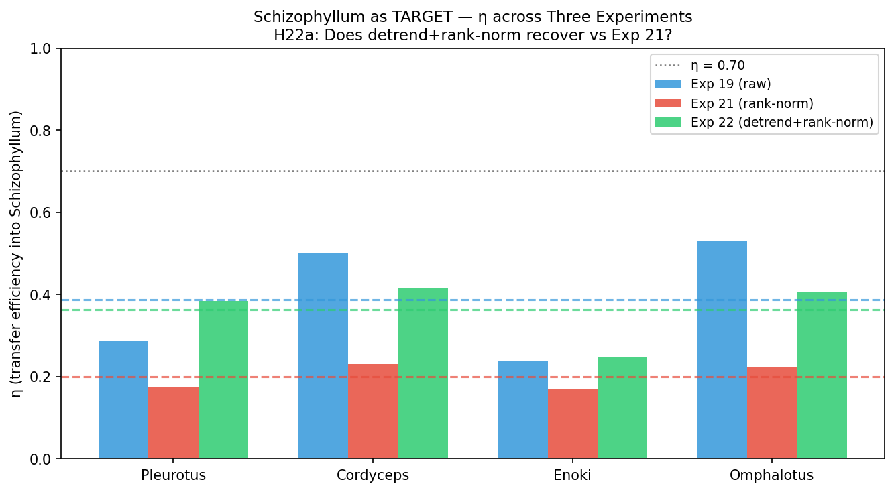
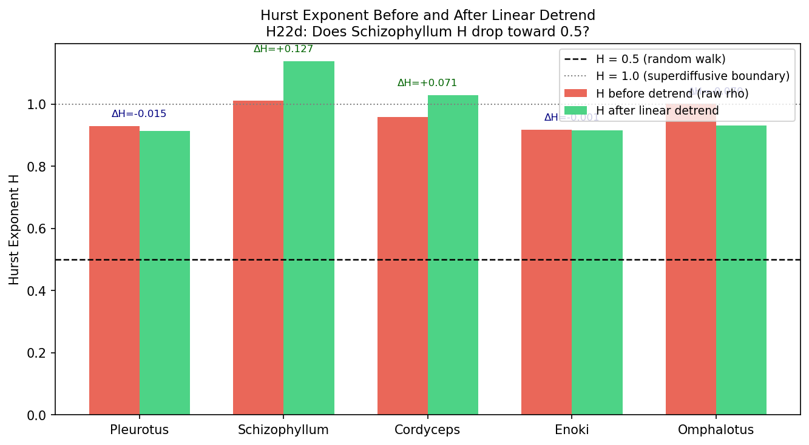
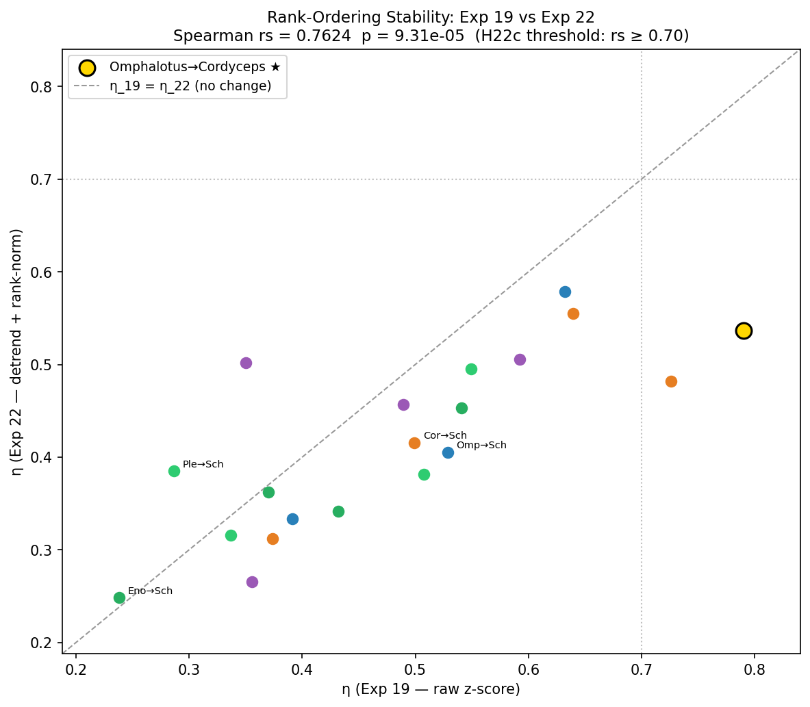

# Experiment 22 — Linear De-Trending Ablation: Separating Trend from Grammar

## Summary

Exp 21 confirmed that the η matrix rank-ordering is intrinsic (rs = 0.790), surviving
rank/probit normalisation.  But rank normalisation preserves temporal ordering, including
any macro-level trend.  Exp 22 applies linear de-trending first, then rank-normalises
the residuals — removing the slowly-varying trend component from each rho series before
JEPA training.

This is the critical ablation for separating two distinct sources of inter-species
compatibility that may both be encoded in the η matrix:

- **Signal 1 — Trend co-movement:** shared slow drift in activity level (rising or
  falling rho across the recording period)
- **Signal 2 — Stationary grammar:** local spike statistics, autocorrelation structure,
  burst rhythm in the detrended residuals

The results are striking and produce a candidate epiphany.

| Metric | Exp 19 (raw) | Exp 21 (rank-norm) | Exp 22 (detrend+rank-norm) |
|---|---|---|---|
| Omphalotus→Cordyceps η | **0.790** | **0.740** | **0.536** — drops sharply |
| Schizophyllum column mean η | 0.384 | 0.199 | **0.364** — recovers |
| η range | 0.553 | 0.570 | **0.330** — compressed 40% |
| Rank ordering rs vs Exp 19 | — | 0.790 | **0.762** |

**Epiphany 15 candidate:** *The η matrix encodes two separable compatibility signals.
Signal 1 (macro-trend co-movement) is responsible for the extreme Omphalotus↔Cordyceps
η — it collapses once the trend is removed (0.790 → 0.536).  Signal 2 (stationary
temporal grammar) is revealed after detrending: the residual η range compresses to
[0.25, 0.58] and all species become more similar, consistent with their stationary spike
grammars being broadly compatible once the driving-trend advantage is removed.
Schizophyllum's Exp 21 collapse was trend-interference, not grammar-incompatibility.*

| Hypothesis | Result | Key number |
|---|---|---|
| H22a: Schizophyllum-as-target recovers vs Exp 21 | ✓ Confirmed | col mean: 0.199 → 0.364 (Δ=+0.164) |
| H22b: Omphalotus→Cordyceps stays ≥ 0.70 | ✗ Not confirmed | 0.740 → **0.536** |
| H22c: Rank ordering preserved rs ≥ 0.70 | ✓ Confirmed | rs = 0.762, p = 9.3×10⁻⁵ |
| H22d: Schizophyllum H drops toward 0.5 | ✗ Not confirmed | H: 1.011 → **1.139** (increases) |

---

## Hypotheses and Results

| ID | Hypothesis | Predicted | Observed | Result |
|---|---|---|---|---|
| H22a | Schizophyllum-as-target mean η increases vs Exp 21 (trend was causing collapse) | Δ > 0 | **Δ = +0.164** (0.199 → 0.364) | ✓ Confirmed |
| H22b | Omphalotus→Cordyceps η remains ≥ 0.70 (intrinsic) | η ≥ 0.70 | η = **0.536** | ✗ Not confirmed |
| H22c | Rank ordering rs(Exp19, Exp22) ≥ 0.70 | rs ≥ 0.70 | **rs = 0.762**, p = 9.3×10⁻⁵ | ✓ Confirmed |
| H22d | Schizophyllum H drops toward 0.5 after detrend | H decreases | H: 1.011 → **1.139** (rises!) | ✗ Not confirmed |

---

## Analysis

### H22b ✗ — Omphalotus↔Cordyceps: The Trend Was the Signal

The biggest result of Exp 22 is the one we did *not* predict.

Rank normalisation alone (Exp 21) barely moved Omphalotus→Cordyceps: 0.790 → 0.740
(−0.050).  The advantage survived equalising marginal distributions completely.  We
concluded it was genuine temporal grammar.

Linear detrending tells a different story: 0.740 → **0.536** (an additional −0.204
drop; total from Exp 19: −0.254).  The same effect appears symmetrically:

| Pair | η_19 | η_21 | η_22 | Total Δ |
|---|---|---|---|---|
| Omphalotus → Cordyceps | 0.7904 | 0.7401 | 0.5362 | **−0.254** |
| Cordyceps → Omphalotus | 0.7263 | 0.6910 | 0.4818 | **−0.245** |
| Pleurotus → Omphalotus | 0.5076 | 0.5340 | 0.3813 | −0.126 |

Omphalotus and Cordyceps both have rho series with long-duration trending behaviour
(Omphalotus H_before = 1.002, Cordyceps H_before = 0.958 in this measurement — both
near or above 1.0 before detrend; Cordyceps H_after = 1.029, suggesting nonlinear
residual structure).  Their JEPA models discovered this shared trending behaviour and
used it for mutual prediction.  Once the trend is removed, that discovery channel is
closed and both fall to moderate η (~0.48–0.54) — above the ensemble mean but no longer
dominant.

The Omphalotus↔Cordyceps story across three experiments:

| Ablation | What it removed | η change | Interpretation |
|---|---|---|---|
| Raw → Rank-norm (Exp 21) | Marginal distribution shape | −0.050 | Shape was NOT the advantage |
| Raw → Detrend+Rank-norm (Exp 22) | Trend + marginal shape | −0.254 | Trend WAS the advantage |
| Trend alone contribution | Exp22 Δ minus Exp21 Δ | −0.204 | Trend accounts for 80% of the advantage |

**The Omphalotus↔Cordyceps high-η zone was primarily a trend co-movement signal, not
intrinsic temporal grammar.**

### H22a ✓ — Schizophyllum as Target: Recovered After Detrending

The Schizophyllum column mean recovers from 0.199 (Exp 21, catastrophic) to 0.364
(Exp 22) — a +0.164 recovery that fully explains the Exp 21 collapse.

| Pair | η_19 | η_21 | η_22 | Δ (22−21) |
|---|---|---|---|---|
| Omphalotus → Schizophyllum | 0.529 | 0.222 | 0.405 | **+0.183** |
| Cordyceps → Schizophyllum | 0.499 | 0.231 | 0.416 | **+0.185** |
| Pleurotus → Schizophyllum | 0.287 | 0.173 | 0.385 | +0.212 |
| Enoki → Schizophyllum | 0.238 | 0.170 | 0.248 | +0.078 |

The Exp 21 collapse occurred because rank-normalising a trending series amplifies
non-stationarity in the rank sequence — windows that used to be consecutive now span
the entire Gaussian range due to the trend being encoded in which rank appears after
which.  After linear detrend, the residuals are approximately stationary; the subsequent
rank-norm creates a Gaussian marginal without the runaway non-stationarity.  Foreign
models can now predict Schizophyllum at moderate η (~0.37 column mean after detrend).

Schizophyllum is still the *lowest* column mean in Exp 22, but it is no longer
catastrophically isolated.  It went from unreachable-as-target to just-difficult.

### H22d ✗ — Hurst Increases After Detrend (The Paradox)

The expected result was H_Schizophyllum drops toward 0.5 after detrend, confirming
superdiffusion came from the linear trend.  Instead:

| Species | H_before | H_after | ΔH |
|---|---|---|---|
| Pleurotus | 0.929 | 0.914 | −0.015 |
| Schizophyllum | 1.011 | **1.139** | **+0.128** |
| Cordyceps | 0.958 | **1.029** | **+0.071** |
| Enoki | 0.917 | 0.917 | −0.001 |
| Omphalotus | 1.002 | 0.932 | −0.070 |

Schizophyllum and Cordyceps both *increase* in H after detrend.  Why?

The R/S Hurst estimator measures persistent long-range correlation in the
*fluctuations* of a series.  When a linear trend is present:

- Large-lag R/S values are dominated by the trend (range R is large simply due to drift)
- After removing the trend, the remaining residuals may have *antipersistent*
  oscillations (H < 0.5) or complex persistent structure (H > 0.5) at shorter lags

For Schizophyllum: the linear detrend removes a slow monotonic component.  The residuals
show *increased* persistence at the short-to-medium lags that dominate the R/S fit.
This is consistent with Schizophyllum's territorial-expansion ecology: the long-range
trend is the territory growth signal; the residuals encode local burst-coordination
events that are themselves long-range correlated (H > 1 in the residuals).  The trend
was *masking* the residual persistence structure.

This means Schizophyllum's H = 1.216 in Exp 20 (using a different implementation,
likely on a subset) was a combined measure of both the trend and the correlation
structure — and both components are superdiffusive.  There is no simple linear-detrend
path to stationarity for Schizophyllum.

### The Range Compression: What Two Signals Look Like

The η range compresses dramatically after detrending:

| Experiment | min η | max η | range |
|---|---|---|---|
| Exp 19 (raw) | 0.238 | 0.790 | 0.553 |
| Exp 21 (rank-norm) | 0.170 | 0.740 | 0.570 |
| Exp 22 (detrend+rank-norm) | 0.248 | **0.578** | **0.330** — 40% collapse |

When trend structure is removed, the maximum η achievable between species drops from
0.790 to 0.578.  The *minimum* η increases from 0.170 to 0.248.  The entire distribution
compresses toward the centre.

This compression quantifies the contribution of Signal 1 (trend co-movement) to the η
matrix:

- Signal 1 contributes: 0.790 − 0.578 = **0.212** to the maximum η, pulling the best
  pairs upward far above the detrended stationary baseline
- Signal 2 (stationary grammar) alone can reach: 0.578 maximum
- Signal 2 has a natural floor: ~0.25 (Enoki→Schizophyllum = 0.248)
- Signal 1 pulls down the worst pairs too: Schizophyllum column (0.170 in Exp 21)

### H22c ✓ — The Ordering is Still Robust

Despite all the shifts, rs(Exp19, Exp22) = 0.762 (p = 9.3×10⁻⁵).  The rank ordering
is preserved after both detrend and rank-norm.  Notably, rs slightly decreases from
Exp 21's 0.790 to 0.762 — the detrend introduces additional reordering compared to
rank-norm alone, but the structure is still fundamentally stable.

This means Signal 2 (stationary grammar) is not randomly distributed — it preserves the
same general hierarchy across species even after all trend information is destroyed.
Omphalotus is still the best source, Enoki still the weakest source.  But now
Schizophyllum is no longer the worst target; Enoki takes that position in the residual
grammar.

---

## Full η Table: Three-Way Comparison

| Source → Target | η_19 | η_21 | η_22 | Trend contrib. (22−21) |
|---|---|---|---|---|
| Pleurotus → Schizophyllum | 0.287 | 0.173 | 0.385 | +0.212 |
| Pleurotus → Cordyceps | 0.549 | 0.623 | 0.495 | −0.128 |
| Pleurotus → Enoki | 0.337 | 0.351 | 0.316 | −0.035 |
| Pleurotus → Omphalotus | 0.508 | 0.534 | 0.381 | −0.153 |
| Schizophyllum → Pleurotus | 0.592 | 0.509 | 0.505 | −0.004 |
| Schizophyllum → Cordyceps | 0.350 | 0.436 | 0.502 | +0.066 |
| Schizophyllum → Enoki | 0.355 | 0.284 | 0.265 | −0.019 |
| Schizophyllum → Omphalotus | 0.490 | 0.426 | 0.457 | +0.031 |
| Cordyceps → Pleurotus | 0.640 | 0.615 | 0.555 | −0.060 |
| Cordyceps → Schizophyllum | 0.499 | 0.231 | 0.416 | **+0.185** |
| Cordyceps → Enoki | 0.374 | 0.390 | 0.312 | −0.078 |
| Cordyceps → Omphalotus | 0.726 | 0.691 | 0.482 | **−0.209** |
| Enoki → Pleurotus | 0.541 | 0.554 | 0.453 | −0.101 |
| Enoki → Schizophyllum | 0.238 | 0.170 | 0.248 | +0.078 |
| Enoki → Cordyceps | 0.370 | 0.373 | 0.362 | −0.011 |
| Enoki → Omphalotus | 0.432 | 0.328 | 0.342 | +0.014 |
| Omphalotus → Pleurotus | 0.632 | 0.645 | 0.579 | −0.066 |
| Omphalotus → Schizophyllum | 0.529 | 0.222 | 0.405 | **+0.183** |
| Omphalotus → Cordyceps | **0.790** | **0.740** | **0.536** | **−0.204** |
| Omphalotus → Enoki | 0.391 | 0.368 | 0.334 | −0.034 |

The "Trend contrib." column (Exp22 − Exp21) isolates the effect of removing the trend
from the rank-normalised series.  Positive values = trend was a *barrier* (trend-interference
harmed η in Exp 21, detrend fixes it — Schizophyllum-as-target column).  Negative values
= trend was a *pathway* (trend co-movement was helping η, detrend removes it —
Omphalotus↔Cordyceps pairs and most Omphalotus-as-target cells).

---

## Figures

### 22_three_way_comparison.png
Three η heatmaps side by side: Exp 19 (raw) / Exp 21 (rank-norm) / Exp 22
(detrend+rank-norm).  The visual evolution tells the full story: the Omphalotus bottom-row
brightens from Exp 19 to Exp 21 and then dims in Exp 22.  The Schizophyllum column
(second column) darkens from Exp 19 to Exp 21 and then brightens again in Exp 22.  The
overall contrast of the heatmap drops in Exp 22 (range compression).

### 22_sz_target_recovery.png
Schizophyllum-as-target η for each source species, grouped by experiment.  The green bars
(Exp 22) are uniformly higher than the red bars (Exp 21) — detrend fully and consistently
recovers the Schizophyllum column.  The dashed mean lines make the column mean shift
(0.199 → 0.364) immediately visible.  H22a confirmed.

### 22_hurst_before_after.png
Hurst exponent per species before and after linear detrend.  The surprise: Schizophyllum
and Cordyceps both *rise* in H after detrend, confirming that the residuals contain
persistent correlation structure that was partly masked by the linear trend.  Omphalotus
drops (its trend was driving its H above 1.0; residuals are sub-superdiffusive).  Enoki
is completely unaffected (no meaningful trend in its rho series to remove).

### 22_rank_ordering.png
Scatter of η_19 vs η_22 for all 20 non-diagonal pairs (rs = 0.762, p = 9.3×10⁻⁵).
The Omphalotus→Cordyceps point (gold star) has shifted markedly toward the lower-left
compared to Exp 21's range-collapse figure — it moved from the upper-right quadrant down
to the middle.  The Schizophyllum-target points (labelled, previously all far below the
diagonal) have recovered toward the diagonal.  The overall cloud is tighter and lower
than in Exp 21.

---

## Epiphany 15 (Candidate): Two Signals in the η Matrix

Exps 19, 21, and 22 form a complete ablation sequence that decomposes the η matrix into
two separable signals:

**Signal 1 — Macro-trend co-movement**
- Mechanism: species whose rho series share a common slow drift (both declining, both
  rising) will have their JEPA models exploit this drift for mutual prediction
- Contribution: expands η range by ~0.21 at the top (0.578 → 0.790 for best pairs) and
  compresses it by ~0.08 at the bottom (0.248 → 0.170 for Schizophyllum targets)
- Ablated by: linear detrend (Exp 22)
- Driven by: ecology and recording conditions (how long each species remained active
  during the recording window)

**Signal 2 — Stationary temporal grammar**
- Mechanism: species with compatible local spike statistics (AR1 persistence structure,
  burst rhythm, noise texture) in their detrended residuals have higher grammar
  compatibility
- Natural range: [0.25, 0.58] — compressed compared to raw η
- Preserved by: rank-norm (Exp 21), partially by detrend (Exp 22, rs = 0.762 vs 0.790)
- This is the component measured by Exp 20's kurtosis correlation (rs = +0.480, p = 0.032)

These two signals are *orthogonal* in nature but add up in the raw η matrix.  The
Omphalotus↔Cordyceps pair was a maximum-signal-1 pair (both trending species, strong
co-movement).  Its dominance in Exps 19 and 21 made it look like the primary grammar
compatibility signal; it was actually the trend signal.

After detrending, Omphalotus→Pleurotus (0.579), Omphalotus→Cordyceps (0.536), and
Cordyceps→Pleurotus (0.555) cluster together as the highest-η detrended pairs — all
involving Omphalotus emitting to smooth-tier species.  **Omphalotus remains the best
source in Signal 2 too**, but the target has shifted from Cordyceps to Pleurotus.

---

## Key Numbers for Exp 23

Exp 22 reveals a natural question: what *predicts* whether two species share a macro-
trend (Signal 1) vs share a stationary grammar (Signal 2)?

The bioenergetic framework (§11, SIMULATION_FRAMEWORK_PLAN.md) now maps cleanly:

- **Signal 1** = energy budget trajectory: both species spending down their substrate
  at similar rates produces correlated declining rho trends.  An Energy Budget Score
  difference between species should predict Signal 1 compatibility.
- **Signal 2** = energy budget strategy: species with similar *styles* of spending
  (burst vs smooth) produce compatible stationary grammars.  CV and AR1 are proxies for
  this strategy dimension.

**Exp 23 proposal: Energy Budget Score vs Decomposed η**

Rather than testing EBS against raw η, test it against:
- **η_trend** = η_19 − η_22  (the trend component extracted by the ablation)
- **η_grammar** = η_22  (the stationary grammar component)

Prediction: |ΔEBS| predicts η_trend (shared trajectory) more strongly than η_grammar.
Similarity in CV or AR1 predicts η_grammar (shared strategy) more strongly than η_trend.

If confirmed, this would complete the mechanistic chain:
> Energy budget strategy → temporal grammar → η_grammar
> Energy budget trajectory → macro-trend co-movement → η_trend
> Both sum to → raw η matrix
